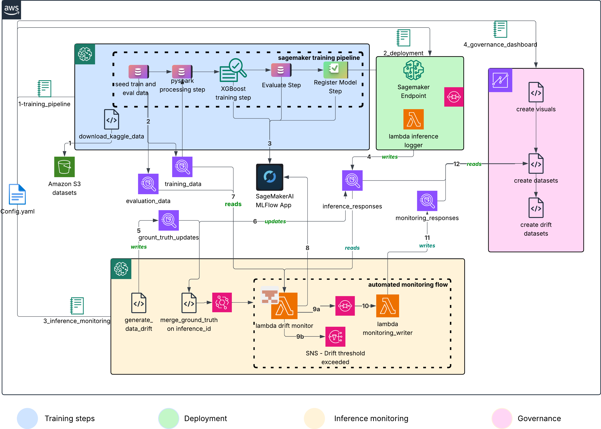

# Automated Drift and Trend Monitoring for ML Models on Amazon SageMaker

End-to-end MLOps reference architecture for credit card fraud detection with automated drift detection, ground truth integration, and governance dashboard. Built on SageMaker Pipelines, MLflow, Evidently AI, and QuickSight.

## Architecture



See [ARCHITECTURE_STEPS.md](docs/ARCHITECTURE_STEPS.md) for detailed step-by-step descriptions.

## Quickstart

### Step 1: Deploy the CloudFormation Stack

Provisions everything: SageMaker domain, user profile, JupyterLab space, **SageMaker MLflow App (serverless)** for experiment tracking, S3 bucket, VPC, SQS queue, Lambda inference logger, and IAM role with all required permissions. On first space launch, the lifecycle script clones this repo, downloads the Kaggle training data, uploads to S3, creates Athena tables, and writes a populated `.env` file (including the MLflow App ARN).

```bash
./cloudformation/deploy-main-stack.sh                           # default: fraud-detection-monitoring in us-west-2
./cloudformation/deploy-main-stack.sh my-stack                  # override stack name
AWS_REGION=us-east-1 ./cloudformation/deploy-main-stack.sh      # override region
./cloudformation/deploy-main-stack.sh --recreate-database       # wipe and recreate Athena database + tables
```

Idempotent — re-runs create if missing, update if present. First create takes ~10–15 minutes.

**The `--recreate-database` flag** drops the `fraud_detection` Athena database and all 7 tables, clears their S3 data, then lets the lifecycle script recreate them empty on next Space launch. Use this to reset to a clean state (e.g., after schema changes or when Iceberg metadata becomes corrupted). The flag is destructive but one-shot — it only fires during that specific deploy; subsequent Space restarts won't wipe data.

**Prerequisites:** AWS CLI configured, IAM permissions for CloudFormation/IAM/SageMaker/Lambda/VPC, a region with SageMaker + MLflow availability (`us-east-1`, `us-west-2`, `eu-west-1`).

See [`cloudformation/README.md`](cloudformation/README.md) for parameter reference, troubleshooting, and update/delete instructions.

### Step 2: Run the JupyterLab Space

1. Open the SageMaker console → Domains → `fraud-detection-monitoring-domain`
2. Select the user profile → **Spaces** → click **Run Space** on the JupyterLab space
3. Once JupyterLab starts, verify the lifecycle script completed:
   - `sample-mlops-bestpractices/` directory is present
   - `sample-mlops-bestpractices/sagemaker-automated-drift-and-trend-monitoring/.env` file has region, role, MLflow ARN, and S3 bucket populated

To pick up new commits without redeploying: **Stop Space**, then **Run Space** (the lifecycle script runs `git pull --ff-only` on every start). Uncommitted local edits are preserved.

### Step 3: Run the Notebooks in Order

Open `sample-mlops-bestpractices/sagemaker-automated-drift-and-trend-monitoring/notebooks/` and run these notebooks sequentially.

> 📊 **Viewing the notebooks online**: GitHub's renderer strips the JavaScript that powers Evidently's interactive drift reports, plotly charts, and ipywidgets — so the saved output cells degrade to raw HTML. To see the live, interactive output without re-running the notebooks, open them via [nbviewer](https://nbviewer.org/github/aws-samples/sample-mlops-bestpractices/tree/main/sagemaker-automated-drift-and-trend-monitoring/notebooks/) instead. Each notebook has a direct nbviewer link in its title cell.

| # | Notebook | Purpose | Time |
|---|----------|---------|------|
| 1 | `1_training_pipeline.ipynb` | Builds and executes the SageMaker training pipeline: preprocessing → XGBoost training → evaluation (quality gate at ROC-AUC ≥ 0.70) → MLflow registration. Does NOT deploy endpoint — see notebook 2 for deployment. | ~20 min |
| 2 | `2_deployment.ipynb` | Deploys the trained model to a SageMaker serverless endpoint with custom Athena-logging inference handler. Select model from registry, configure resources, test deployment. | ~10 min |
| 3 | `3_inference_monitoring.ipynb` | Deploys the drift-monitoring infrastructure stack (SNS/SQS/writer Lambda/CloudWatch), tests the endpoint, simulates ground truth, runs Evidently data + model drift detection, and sets up the daily-scheduled drift Lambda. Writes to `monitoring_responses` (Athena) and optionally MLflow. | ~30 min |
| 4 | `4_governance_dashboard.ipynb` | Creates a QuickSight governance dashboard (datasource, datasets, analysis, published dashboard) with auto-refresh via EventBridge + Lambda. Requires QuickSight Enterprise subscription. See [QuickSight Setup Guide](docs/screenshots/quicksight/README.md) for first-time setup. | ~15 min |

**Optional notebooks** (run as needed):

| # | Notebook | Purpose |
|---|----------|---------|
| 5 | `5_optional_version_validation.ipynb` | Verifies MLflow model version matches the deployed endpoint and Athena inference logs (traceability check). |
| 6 | `6_optional_cleanup.ipynb` | Deletes all AWS resources created outside CloudFormation (Lambda functions, endpoints, SNS topics, dashboards, CloudWatch alarms). |
| 7 | `7_optional_shap_explainability.ipynb` | Generates SHAP global and per-prediction feature importance plots for the trained model. |

### What to expect during long-running cells

- **Notebook 1 cell 2** runs `! uv pip install -e ../`. If you see `No virtual environment found`, the error message tells you how to resolve it (run `uv venv` or add `--system`).
- **Notebook 3 Section 7.2** builds the drift-monitor Lambda as a container image. SageMaker JupyterLab spaces don't have a local Docker daemon, so the script auto-falls back to `src/setup/codebuild_image.py` — a plain boto3 wrapper that provisions an ephemeral AWS CodeBuild project, runs the build there, pushes to ECR, and cleans up. **First build takes ~5–8 minutes**; subsequent rebuilds (when you set `REDEPLOY_LAMBDAS = True`) take ~3–5 min. Watch the CodeBuild output stream in the cell.
- **Notebook 4 cell 2** queries QuickSight. QuickSight has a fixed *identity region* (the region your QuickSight account was first activated in) — all QuickSight API calls must hit that endpoint regardless of where your data lives. Default is `us-east-1`; override via `QUICKSIGHT_IDENTITY_REGION` in `.env` if your account is elsewhere.
- **Notebook 3 Section 7.1** defaults `ALERT_EMAIL=nobody@example.com` so the deploy succeeds out of the box. Replace it with a real email in `.env` if you want SNS alerts to actually arrive — `example.com` is IANA-reserved as non-deliverable.

## Running in Production

The notebooks are the recommended path for first-time setup, exploration, and interactive drift analysis. For CI/CD, scheduled jobs, or automated re-deployments, every stage has a headless CLI equivalent — no Jupyter kernel required. Run these in order to reproduce the full notebook workflow end-to-end:

### 1. Deploy Base Infrastructure

The base CloudFormation stack (SageMaker domain, S3 data bucket, Athena tables, SageMaker MLflow App, inference-logging path) must exist before anything else. This is the same stack the [Quickstart](#quickstart) deploys via the console.

```bash
# Deploy or update the base stack (idempotent — safe to re-run)
./cloudformation/deploy-main-stack.sh
```

### 2. Train, Register, and Deploy the Model

```bash
# One-time: create the Athena database + tables from src/config/dataset_schema.yaml
python main.py setup --force-recreate

# Create (or update) the SageMaker pipeline definition
python main.py pipeline create --pipeline-name fraud-detection-pipeline

# Start a run and block until it finishes (fails the CI job on pipeline failure)
python main.py pipeline start --pipeline-name fraud-detection-pipeline --wait

# Inspect recent runs / a specific run's step-by-step status
python main.py pipeline list     --pipeline-name fraud-detection-pipeline
python main.py pipeline describe --execution-arn <arn-from-list>

# Deploy the approved model to a serverless endpoint
python main.py deploy create --wait
python main.py deploy status --endpoint-name fraud-detector-endpoint

# Smoke-test the endpoint with sample traffic
python main.py test-endpoint --endpoint-name fraud-detector-endpoint --num-samples 50
```

### 3. Provision the Drift-Monitoring Plane

Adds the SNS topic, SQS results queue, monitoring-results writer Lambda, drift-monitor IAM role, CloudWatch dashboard + alarms. This is a **separate stack** from the base — deploy it after the base stack is live and the endpoint exists:

```bash
./cloudformation/deploy-drift-monitoring.sh \
    --data-bucket <your-data-bucket> \
    --endpoint-name fraud-detector-endpoint \
    --alert-email you@example.com
```

Then build and deploy the scheduled drift-monitor Lambda (container image — CloudFormation can't build these):

```bash
# One-time: bootstrap the Lambda execution role and grant Lake Formation access
python main.py monitoring bootstrap-role
python main.py monitoring grant-lake-formation

# Deploy the writer Lambda (drains SQS → writes to monitoring_responses)
python main.py monitoring deploy-writer

# Build + push the drift-monitor container image, create the Lambda, wire the daily schedule
python main.py monitoring deploy-lambda --alert-email you@example.com

# Deploy the CloudWatch dashboard + alarms
python main.py monitoring deploy-cloudwatch --endpoint-name fraud-detector-endpoint

# Test the Lambda end-to-end and view logs
python main.py monitoring test
python main.py monitoring logs --limit 50

# Tune thresholds without redeploying (merges into existing env vars)
python main.py monitoring update-thresholds \
    --data-drift-threshold 0.15 \
    --model-drift-threshold 0.03

# Pause / resume the daily schedule
python main.py monitoring disable-schedule
python main.py monitoring enable-schedule
```

### 4. Enable Scheduled Inference and Batch Transform (Optional)

```bash
# EventBridge-triggered Lambda that invokes the endpoint on a schedule
python main.py schedule-inference create --endpoint-name fraud-detector-endpoint

# EventBridge-triggered Lambda that runs SageMaker batch transform jobs
python main.py schedule-batch create --model-name fraud-detection
```

### 5. Provision the Governance Dashboard

> ⚠️ **First-time QuickSight setup required.** If you've never used QuickSight in this AWS account, `main.py dashboard create` will warn and its API calls will fail. See [QuickSight prerequisites](#quicksight-prerequisites-one-time-per-account) below — it's a 5-minute one-time console setup.

```bash
# Create the QuickSight datasets, analysis, and published dashboard
python main.py dashboard create

# Tear it all down (dashboard → analysis → datasets → datasource → views)
python main.py dashboard delete --confirm
```

#### QuickSight prerequisites (one-time per account)

`main.py dashboard create` calls the QuickSight Definition API to build datasets, an analysis, and a published dashboard. That API requires QuickSight to already exist in the account with Enterprise edition and at least one user who can own the assets. **Do this once, then dashboard create/delete become reproducible from the CLI.**

> 📖 **For detailed setup instructions with screenshots**, see the [QuickSight Setup Guide for New Accounts](docs/screenshots/quicksight/README.md). This guide includes troubleshooting, region configuration, and security best practices.

**Step-by-step from a brand-new AWS account:**

1. **Sign up for QuickSight (once per AWS account).**
   Sign in to the AWS console, search for **QuickSight**, click **Sign up for QuickSight**.
   - Edition: **Enterprise** (Standard doesn't support the Definition API used to build dashboards programmatically).
   - Authentication: **Use IAM federated identities and QuickSight-managed users** (default).
   - Region: pick your identity region — usually `us-east-1`. QuickSight has a *fixed identity region* per account (chosen at sign-up, can't be changed easily). Its API calls all hit that region even if your data is elsewhere. If your account's identity region isn't `us-east-1`, set `QUICKSIGHT_IDENTITY_REGION=<region>` in `.env`.
   - Account name: anything memorable (used in dashboard URLs).
   - Notification email: yours.
   - S3 access: leave defaults for now — step 4 below grants what's needed.

2. **Create at least one QuickSight user with admin rights** (skip if you already exist there).
   In QuickSight console → click your username (top right) → **Manage QuickSight** → **Manage users** → **Invite users**. Add your IAM/SSO identity as **Author** or **Admin**. Confirm the invite email.

3. **Verify you can open QuickSight.**
   Log into [https://quicksight.aws.amazon.com/](https://quicksight.aws.amazon.com/). You should see the QuickSight home page with your username in the top-right. If you see "You are not signed up for QuickSight," go back to step 1.

4. **Ensure QuickSight can read from S3 and Athena.**
   QuickSight console → username → **Manage QuickSight** → **Security & permissions** → **Manage QuickSight access to AWS services** → check **Amazon S3** (select the data bucket the base stack created, `${ProjectName}-data-${account_id}`) and **Amazon Athena**. Save. (`main.py dashboard create` also attaches these permissions programmatically via `grant_governance_permissions()`, but doing it in the console first avoids a chicken-and-egg problem if the CLI runs before your admin identity is fully provisioned.)

5. **Run `main.py dashboard create`.**
   Now `python main.py dashboard create` provisions the Athena datasource, five datasets, the analysis, and the published dashboard. The CLI prints a `dashboard_url` — open it, or navigate in the QuickSight console → **Dashboards** → **Fraud Governance Dashboard**.

**Symptoms → fix:**

- *"QuickSight not subscribed for this account"* — step 1 wasn't done. Sign up.
- *"AccessDenied: quicksight:CreateDataSource"* — step 2 wasn't done, or your IAM identity isn't a QuickSight user yet.
- *"AccessDenied on S3 bucket"* when opening the dashboard — step 4 wasn't done, or the S3 permission was granted to the wrong bucket.
- *"Definition API requires Enterprise edition"* — step 1 was done with Standard. Upgrade via console → **Manage QuickSight** → **Subscription** → **Upgrade to Enterprise**.
- Dashboard exists but visuals show "No data" — check the base stack's `monitoring_responses` and `inference_responses` Athena tables have rows. `python -c "from src.governance.create_governance_dashboard import verify_athena_data; print(verify_athena_data())"` runs the same check the CLI does.

### 6. Teardown

Order matters — the out-of-band drift Lambda references the CFN-provisioned SQS queue, SNS topic, and IAM role:

```bash
# 1. Drift monitoring plane
./cloudformation/delete-drift-monitoring.sh   # (create this by adapting delete-main-stack.sh)
# or: aws cloudformation delete-stack --stack-name fraud-detection-drift-monitoring

# 2. Governance dashboard
python main.py dashboard delete --confirm

# 3. Endpoint
python main.py deploy delete --confirm

# 4. Base stack (uses the robust deletion path that drains Iceberg tables, empties S3, stops Studio apps first)
./cloudformation/delete-main-stack.sh
```

Full command reference: `python main.py --help` and `python main.py <command> --help`.

### CloudFormation Scripts Reference

| Script | Purpose | When to use |
|--------|---------|-------------|
| `cloudformation/deploy-main-stack.sh` | Deploy/update the base stack (`sagemaker-mlflow-setup.yaml`) | Initial setup + subsequent template updates |
| `cloudformation/deploy-drift-monitoring.sh` | Deploy the drift-monitoring stack (`drift-monitoring-infra.yaml`) | After base stack + notebook 1/2 (endpoint exists) |
| `cloudformation/cleanup-main-resources.sh` | Pre-delete cleanup of SageMaker Studio apps/spaces | Before `delete-main-stack.sh` if Spaces are running |
| `cloudformation/delete-main-stack.sh` | Robust stack deletion (drains Iceberg tables, empties S3, stops Studio) | Normal teardown of the base stack |
| `cloudformation/force-delete-main-stack.sh` | Nuclear option — deletes stuck resources manually (ENIs, subnets, versioned S3) | When `delete-main-stack.sh` sits in `DELETE_FAILED` |

## What This Solution Does

### Training Pipeline (Notebook 1)
1. **Seed Athena** — Idempotently loads the predictions CSV into `training_data` (80%) + `evaluation_data` (20%), deterministic hash split on `transaction_id`
2. **Preprocess** — Reads `training_data` (train channel) and `evaluation_data` (test channel) from Athena; encodes categoricals; emits XGBoost-format CSVs
3. **Train** — XGBoost with automatic class imbalance handling (`scale_pos_weight`)
4. **Evaluate** — Computes ROC-AUC, PR-AUC, precision, recall, F1, confusion matrix; writes `baseline.json` with metrics + Iceberg snapshot IDs + code commit SHA
5. **Quality Gate** — Registers the model only if ROC-AUC ≥ 0.70
6. **MLflow Registration** — Logs metrics, parameters, and model artifact to MLflow. The Model Registry record's `ModelStatistics` URI points at `baseline.json` (used by the drift monitor)

### Deployment (Notebook 2)
- **Model Selection** — Choose approved model from SageMaker Model Registry
- **Endpoint Creation** — Serverless endpoint with custom inference handler
- **Athena Logging** — Every prediction logged to SQS → Lambda → Athena (zero added latency)
- **Testing** — Verify endpoint responds correctly to test predictions

### Monitoring (Notebook 3)

The monitoring system captures every prediction, integrates delayed ground truth, and runs automated drift analysis. All defaults are configurable via `src/config/config.yaml`.

#### Real-Time Inference Capture

Applications send transactions with **30 features** to the SageMaker AI endpoint. The **custom inference handler** runs the XGBoost model (solution works with any model framework) and returns the prediction immediately. In the background, the handler **asynchronously sends** the full prediction record to an Amazon SQS queue, adding **minimal latency** (~10-50ms) to the response path.

**Logged fields per prediction:**
- Input features (30 feature values as JSON)
- Prediction (0/1 fraud classification)
- Confidence score (probability_fraud, probability_non_fraud)
- Model version, MLflow run ID, model package ARN
- Endpoint name, request timestamp
- Latency metrics (inference time, preprocessing time)
- Transaction metadata (transaction_id, customer_id, amount)

#### Buffered Batch Writes to Data Lake

A **Lambda consumer** (`{ProjectName}-inference-logger`, deployed via CloudFormation) reads from the SQS queue in **configurable batches**:
- **Batch size**: 10 messages (default)
- **Batch window**: 30 seconds (max wait time)
- Whichever threshold is hit first triggers a write

Each batch is written to the **`inference_responses` Athena Iceberg table**, partitioned by date for efficient querying. This creates a complete, queryable audit trail of every prediction with:
- Zero inference latency impact (async SQS)
- 10-300x file count reduction vs. per-request logging
- 62% faster Athena queries vs. SageMaker DataCaptureConfig

#### Ground Truth Integration

As fraud investigations complete (days or weeks later), confirmed labels flow into the **`ground_truth_updates`** table. Athena **MERGE statements** join confirmed labels back to the original inference records:

```sql
MERGE INTO inference_responses AS target
USING ground_truth_updates AS source
ON target.inference_id = source.inference_id
WHEN MATCHED AND target.ground_truth IS NULL THEN
  UPDATE SET 
    target.ground_truth = source.actual_fraud,
    target.ground_truth_timestamp = source.confirmation_timestamp,
    target.days_to_ground_truth = date_diff('day', target.request_timestamp, source.confirmation_timestamp)
```

This tracking of **`days_since_prediction`** for each label makes accurate model performance calculation possible despite real-world label delays (1-30 days typical in fraud detection).

#### Automated Daily Drift Analysis

At **2 AM UTC daily** (configurable via EventBridge schedule - adjust based on volumes and monitoring granularity needed), EventBridge triggers a Lambda function (`{ProjectName}-drift-monitor`) that:

1. **Queries recent inference data** from Athena
   - Last N days configurable in `config.yaml` (deployed default: 1 day for both data/model drift)
   - Filters: `WHERE ground_truth IS NOT NULL` for model drift (skipped if insufficient samples)

2. **Loads frozen baseline distributions**
   - Reads registered `baseline.json` from the deployed ModelPackage (via SageMaker Model Registry)
   - **Time-travels** to exact Iceberg snapshots:
     - `training_data FOR VERSION AS OF <training_snapshot_id>` (baseline for **data drift**)
     - `evaluation_data FOR VERSION AS OF <evaluation_snapshot_id>` (baseline for **model drift**)
   - No hardcoded baselines, no stale env vars - always monitors against the exact data the deployed model was trained/scored on

3. **Runs Evidently AI drift detection**
   - **DataDriftPreset**: Generates PSI (Population Stability Index) scores for every feature
     - Uses `evidently>=0.4.22,<1` (see `pyproject.toml`)
     - Statistical tests: Kolmogorov-Smirnov (numerical), Chi-square (categorical), Wasserstein distance
   - **ClassificationPreset**: Generates ROC-AUC, precision, recall, F1, confusion matrix
     - Only runs when ground truth is available
     - Requires minimum sample size (default: 100 predictions with labels)

4. **Compares against configurable thresholds**
   - **Data drift threshold**: 0.2 (20% of features drifted = alert)
   - **Model drift threshold**: 0.05 (5% ROC-AUC degradation = alert)
   - Separate sensitivity levels for data vs. model drift
   - All thresholds in `config.yaml` or Lambda environment variables

5. **Writes results to multiple destinations**
   - `monitoring_responses` Athena table (durable source of truth, read by QuickSight)
   - MLflow artifacts (HTML Evidently reports) + metrics
   - SNS topic (email/SMS alerts when thresholds exceeded)
   - Backfills `monitoring_run_id` onto analyzed `inference_responses` rows for traceability

- **Inference logging** — Every prediction → SQS → Lambda batches (10 msgs or 30s) → `inference_responses` Iceberg table
- **Ground truth integration** — Simulated (dev) or fed from fraud investigation systems (prod) → `ground_truth_updates` table → MERGE into `inference_responses`
- **Drift detection** — Evidently `DataDriftPreset` against the frozen `training_data` baseline (KS for numerics, chi-square for categoricals, PSI per feature) + `ClassificationPreset` against the frozen `evaluation_data` baseline (ROC, PR, confusion matrix). Thresholds configurable via `src/config/config.yaml`.
  - **⚠️ Important:** In MLflow, you may initially see **only data drift metrics** (not model drift). This is expected! **Data drift** runs on any predictions immediately (compares input feature distributions), while **model drift** requires ground truth labels to measure performance degradation (ROC-AUC, precision, recall). In fraud detection, ground truth arrives 1-30 days after transactions when fraud investigations complete. Until the `ground_truth_updates` table is populated and MERGE'd into `inference_responses`, the drift Lambda skips model drift checks (prints "⚠️ Not enough samples with ground truth"). Once ground truth is available (run notebook 3 Section 6 to simulate, or wait for real fraud confirmations in production), subsequent drift runs will log both data and model drift metrics to MLflow.

### Drift Detection Configuration: Three Sources

Configuration values differ between notebook testing, Lambda code defaults, and actual deployed values. Understanding these differences is critical for tuning the system:

| Variable | Notebook 3 | Lambda Code Default<br/>(if not deployed) | Deployed via Script<br/>(`deploy_lambda_container.sh`) | Where to Change |
|----------|------------|-------------------------------------------|--------------------------------------------------------|-----------------|
| `MIN_SAMPLES` | **50** | **100** | **100** (inherits code default) | Notebook: line 1027<br/>Lambda: env var or code line 61 |
| `DATA_DRIFT_LOOKBACK_DAYS` | incremental* | **7 days** | **1 day** ⚠️ | **Script line 315**<br/>Or pass as Lambda env var |
| `MODEL_DRIFT_LOOKBACK_DAYS` | **30 days** | **30 days** | **1 day** ⚠️ | **Script line 316**<br/>Or pass as Lambda env var |
| `DATA_DRIFT_THRESHOLD` | **0.20** (20%) | **0.2** | **0.2** (script arg 2) | Script argument<br/>`config.yaml` drift_thresholds.data_drift<br/>Lambda env var |
| `MODEL_DRIFT_THRESHOLD` | **0.05** (5%) | **0.05** | **0.05** (script arg 3) | Script argument<br/>`config.yaml` drift_thresholds.model_drift<br/>Lambda env var |
| `KS_PVALUE_THRESHOLD` | (not set) | **0.05** | **0.05** (inherits code default) | Lambda env var or code line 59 |

**\*Notebook incremental mode:** Notebook 3 queries `MAX(monitoring_timestamp)` from the last drift run and only analyzes predictions since that timestamp. This avoids re-analyzing the same data on each notebook re-run. The Lambda uses fixed rolling windows instead.

**⚠️ Critical:** The deployment script **hardcodes 1-day lookback windows** (lines 315-316), overriding the Lambda code defaults of 7/30 days. This means:
- **As deployed**: Lambda analyzes last 1 day of predictions for both data and model drift
- **Lambda code says**: 7 days for data drift, 30 days for model drift (ignored when deployed via script)
- **Why 1 day?** Designed for daily scheduled runs where you want to detect drift in yesterday's predictions, not a rolling multi-day window

**To use longer lookback windows in production:**
1. Edit `scripts/deploy_lambda_container.sh` lines 315-316 to desired values (e.g., `"7"` and `"30"`)
2. Redeploy: `cd scripts && ./deploy_lambda_container.sh your-email@example.com`
3. Or update Lambda environment variables directly via AWS console / CLI after deployment

**When to use each:**
- **1 day (deployed default)**: Daily monitoring of yesterday's predictions, fast alerts for sudden drift
- **7/30 days (code default)**: Smoothed trends, better statistical significance, tolerates low daily volume
- **Incremental (notebook)**: Interactive testing without re-processing already-analyzed predictions

### Configuring Shorter Drift Windows (Minutes Instead of Days)

For high-volume real-time applications, you may want drift detection to run every 15 minutes instead of daily. This requires converting the lookback windows from days to minutes:

**Use case:** Detect drift within the hour on high-throughput endpoints (100s-1000s predictions/minute) rather than waiting for daily batch checks.

**Step-by-step conversion:**

1. **Update deployment script** (`scripts/deploy_lambda_container.sh` lines 315-316):
   
   Replace:
   ```bash
   "DATA_DRIFT_LOOKBACK_DAYS": "1",
   "MODEL_DRIFT_LOOKBACK_DAYS": "1",
   ```
   
   With:
   ```bash
   "DATA_DRIFT_LOOKBACK_MINUTES": "60",
   "MODEL_DRIFT_LOOKBACK_MINUTES": "120",
   ```

2. **Update Lambda code** (`src/drift_monitoring/lambda_drift_monitor.py` lines 64-65):
   
   Replace:
   ```python
   DATA_DRIFT_LOOKBACK_DAYS = int(os.getenv('DATA_DRIFT_LOOKBACK_DAYS', '7'))
   MODEL_DRIFT_LOOKBACK_DAYS = int(os.getenv('MODEL_DRIFT_LOOKBACK_DAYS', '30'))
   ```
   
   With:
   ```python
   DATA_DRIFT_LOOKBACK_MINUTES = int(os.getenv('DATA_DRIFT_LOOKBACK_MINUTES', '60'))
   MODEL_DRIFT_LOOKBACK_MINUTES = int(os.getenv('MODEL_DRIFT_LOOKBACK_MINUTES', '120'))
   ```

3. **Update drift functions** (same file):
   
   In `check_data_drift()` function (around line 431), replace:
   ```python
   lookback_start = (datetime.now() - timedelta(days=DATA_DRIFT_LOOKBACK_DAYS)).strftime('%Y-%m-%d %H:%M:%S')
   ```
   
   With:
   ```python
   lookback_start = (datetime.now() - timedelta(minutes=DATA_DRIFT_LOOKBACK_MINUTES)).strftime('%Y-%m-%d %H:%M:%S')
   ```
   
   In `check_model_drift()` function (around line 526), replace:
   ```python
   lookback_start = (datetime.now() - timedelta(days=MODEL_DRIFT_LOOKBACK_DAYS)).strftime('%Y-%m-%d %H:%M:%S')
   ```
   
   With:
   ```python
   lookback_start = (datetime.now() - timedelta(minutes=MODEL_DRIFT_LOOKBACK_MINUTES)).strftime('%Y-%m-%d %H:%M:%S')
   ```

4. **Update EventBridge schedule** (in `scripts/deploy_lambda_container.sh` line 64 or `src/config/config.yaml`):
   
   In deployment script, the schedule is read from config. Update `config.yaml`:
   ```yaml
   drift_monitor:
     schedule: "rate(15 minutes)"  # Was: "cron(0 2 * * ? *)"
   ```

5. **Optional: Update notebook constants** (`src/config/config.py`):
   
   For consistency with notebook 3, rename:
   ```python
   # Old:
   MONITORING_DATA_DRIFT_LOOKBACK_DAYS = config_yaml.get('monitoring', {}).get('data_drift_lookback_days', 7)
   MONITORING_MODEL_DRIFT_LOOKBACK_DAYS = config_yaml.get('monitoring', {}).get('model_drift_lookback_days', 30)
   
   # New:
   MONITORING_DATA_DRIFT_LOOKBACK_MINUTES = config_yaml.get('monitoring', {}).get('data_drift_lookback_minutes', 60)
   MONITORING_MODEL_DRIFT_LOOKBACK_MINUTES = config_yaml.get('monitoring', {}).get('model_drift_lookback_minutes', 120)
   ```

6. **Redeploy:**
   ```bash
   cd scripts
   ./deploy_lambda_container.sh your-email@example.com
   ```

**Expected behavior after conversion:**
- Lambda runs every 15 minutes (vs. daily at 2 AM)
- Data drift: analyzes last 60 minutes of predictions
- Model drift: analyzes last 120 minutes of predictions with ground truth
- Faster drift detection but higher Lambda invocation costs
- More sensitive to short-term anomalies (weekday vs. weekend patterns, lunch-hour spikes)

**Cost considerations:**
- Daily schedule: ~30 Lambda invocations/month
- 15-minute schedule: ~2,880 Lambda invocations/month (96x more)
- With 512 MB memory and 60s avg runtime: ~$3-5/month → ~$200-300/month
- Use minute-based windows only when real-time drift detection justifies the cost
- **Per-run traceability** — Each drift run gets a `monitoring_run_id` (`notebook-drift-*` from the notebook, `drift-*` from the Lambda). Both writers (a) record one row in `monitoring_responses` keyed on this id, and (b) backfill the same id onto the `inference_responses` rows the run scored — `WHERE monitoring_run_id IS NULL` makes this naturally delta-shaped, so each run only tags predictions never measured before. QuickSight can join the two tables on `monitoring_run_id` to show "what predictions did this run measure?". The **notebook additionally** scopes the *drift compute window itself* to `request_timestamp > MAX(monitoring_timestamp)`, letting you re-run drift detection on just the new predictions since the last run.
- **Automated daily checks** — EventBridge → Lambda (`fraud-detection-drift-monitor`) at 2 AM UTC. Writes summary to `monitoring_responses` (Athena is the durable source of truth — QuickSight reads directly from here), optionally logs metrics + Evidently HTML reports to MLflow, sends SNS alert if drift exceeds thresholds. Lambda scopes its drift compute to fixed 7/30-day rolling windows (data drift / model drift respectively); the `monitoring_run_id` backfill runs after every Lambda invocation.

### Governance (Notebook 4)
QuickSight dashboard with four sheets and **30 visuals** — each visual answers a specific "how is X drifting at Y granularity?" question. Every sheet ends with a raw source-data table so you can inspect the exact `monitoring_responses` / `inference_responses` / `feature_drift_detail` rows powering the charts.

> 📊 **Creating Custom Visualizations**: Beyond the pre-built 30 visuals, QuickSight Q allows you to create custom charts using natural language queries. See the [QuickSight Natural Language Query Guide](docs/screenshots/quicksight/README.md#creating-custom-visualizations-with-natural-language) for sample queries like "Show me top 5 drifted features over the last 30 days with a threshold line" or "Create a Sankey diagram showing prediction distribution shifts".

**Tab 1 — Model Drift Trends (11 visuals):**

- **Trending performance**: ROC-AUC baseline vs current over time, precision/recall/F1/accuracy over time, ROC-AUC degradation-% over time (threshold-relative, alert-shaped).
- **Sliced by lineage**: ROC-AUC by `model_version`, drift-verdict rate by `model_package_arn`, drift-verdict rate by `endpoint_name`, performance by `training_snapshot_id` (does retraining actually help?).
- **Confusion matrix over time** (TP/FP/TN/FN stacked bars) — for imbalanced targets this is *more* useful than raw accuracy, since accuracy can rise from more true-negatives while false-negatives (missed fraud) grow silently.
- **Ground-truth coverage over time** — % of daily predictions that have labels. Model-drift verdicts are only trustworthy when this is high; falling coverage is the *precondition* for all the model-drift metrics on this tab going stale.
- **Lineage audit table** — every run's `monitoring_run_id` × endpoint × model_version × model_package_arn × training_snapshot_id × evaluation_snapshot_id, plus drift verdicts. The auditor's screenshot.
- **Latest ROC-AUC KPI** — current value with sparkline.

**Tab 2 — Data Drift Trends (10 visuals):**

- **Aggregate trends**: drift share over time, drifted-features count, severity-colored alerts timeline, latest-share KPI.
- **Sliced by granularity**: drift share by `model_version`, drift share by `endpoint_name`.
- **Prediction-score distribution over time** (box plot per day) — the **leading indicator**. Data drift and concept drift both surface as a shift in the probability distribution BEFORE ground truth is collected and BEFORE ROC-AUC dips. Bimodal → middle-heavy = model losing certainty.
- **Sample-size reliability** — bar chart of `data_sample_size` per run, so shaky-verdict runs (< Evidently's recommended 1000 rows for stable KS p-values) are visible.
- **Inference volume vs drift share correlation** (combo chart) — spikes in traffic often cause spurious drift on small feature subsets.
- **Source-data table** — every `monitoring_responses` row with fields for cross-referencing.

**Tab 3 — Feature Drift Trends (9 visuals):**

- **Per-feature trend**: drift-score timeline colored by feature, feature-drift heatmap over time (features × days), highest-current drift KPI.
- **Ranking**: top-15 most-drifting features (avg score), severity distribution across top-15.
- **Max feature drift score per run** — the *worst* feature per run, colored by model version. Moderate averages (Tab 2's D1) can hide one catastrophically-drifted feature; this visual makes the peak visible.
- **Repeat-offender features** — count of runs each feature has been flagged in. Chronic drifters → retraining candidates. One-off spikes → data-quality issues.
- **Cross-model heatmap** — feature × `model_version` pivot. "Is this feature drifting consistently across our retrained models, or was it a training-artifact of one specific version?"
- **Per-feature detail table** — every run × feature × severity × model_version row for lookup.

**How the tabs work together:**

1. Start on Tab 1 — the top-level "is my model still healthy?" question. If ROC-AUC-degradation-% (M10) crossed the threshold or the confusion matrix (M9) shifted, drill down.
2. Tab 2 tells you *whether* the input distribution shifted (data drift) — and via the score-distribution box plot (D9), you get a signal that's usually visible *before* Tab 1's metrics degrade.
3. Tab 3 tells you *which* features drifted — the max-drift-per-run (F8) and repeat-offenders (F9) charts pinpoint retraining targets.

Auto-refreshes daily at 3 AM UTC via EventBridge + Lambda after the 2 AM drift monitoring run. Visual titles include some fraud-domain framing where the reference dataset makes it natural (e.g. severity buckets in `drift_severity`); the underlying column bindings are all schema-driven, so BYO-dataset users get correct data with default titles they can rename in the QuickSight console.

## Choosing a Monitoring Backend

MLflow and QuickSight are **independent**, not layered. Every drift run writes its verdict + `monitoring_run_id` directly to the `monitoring_responses` Athena table; QuickSight reads that table via Athena regardless of whether MLflow is running. Pick by workload:

| Workload | Recommended backend | Why |
|----------|---------------------|-----|
| **Online endpoint monitoring** (real-time / serverless inference) | **QuickSight** | Athena-backed dashboards refresh on schedule against the live `inference_responses` + `monitoring_responses` tables — right shape for continuously-updating traffic and stakeholder-facing views |
| **Batch inference monitoring** (scheduled transforms, offline scoring) | **MLflow or QuickSight** | MLflow gives per-run experiment tracking + Evidently HTML artifacts + parameter/metric comparison across runs — natural fit for discrete batch jobs. QuickSight still works if you prefer the same dashboard surface as online monitoring |

Both backends consume the same `monitoring_responses` rows. Using MLflow does not require QuickSight and vice-versa — you can turn either off without breaking the other. The daily drift Lambda in this reference implementation writes to both because they answer different questions (MLflow: "what changed between run N and run N-1, with the Evidently HTML to inspect?"; QuickSight: "what does the last 90 days of drift look like on a shared dashboard?").

## Project Structure

```
sagemaker-automated-drift-and-trend-monitoring/
├── cloudformation/
│   ├── sagemaker-mlflow-setup.yaml    # Base stack (SageMaker domain, S3, Athena, MLflow)
│   ├── drift-monitoring-infra.yaml    # Drift-monitoring stack (SNS, SQS, writer Lambda, CW dashboard)
│   ├── deploy-main-stack.sh           # Deploy/update the base stack
│   ├── deploy-drift-monitoring.sh     # Deploy the drift-monitoring stack
│   ├── cleanup-main-resources.sh      # Pre-delete cleanup (stop Studio apps/spaces)
│   ├── delete-main-stack.sh           # Robust base-stack teardown
│   ├── force-delete-main-stack.sh     # Nuclear option for stuck stacks
│   └── README.md                      # CloudFormation reference
├── notebooks/                         # Run these in order — see Step 3 above
│   ├── 1_training_pipeline.ipynb
│   ├── 2_deployment.ipynb
│   ├── 3_inference_monitoring.ipynb          # Main drift-monitoring workflow (CFN-backed)
│   ├── 3_inference_monitoring_legacy.ipynb   # DEPRECATED: pre-CFN imperative setup
│   ├── 4_governance_dashboard.ipynb
│   ├── 5_optional_version_validation.ipynb
│   ├── 6_optional_cleanup.ipynb
│   └── 7_optional_shap_explainability.ipynb
├── src/
│   ├── train_pipeline/                # Pipeline definition + preprocessing/training/evaluation steps
│   ├── drift_monitoring/              # Drift detection Lambdas, ground truth utilities, Evidently wrappers
│   ├── governance/                    # QuickSight dashboard provisioning
│   ├── setup/                         # IAM role + infrastructure helpers, Kaggle dataset downloader (download_kaggle_dataset.py)
│   ├── config/                        # config.py + config.yaml (drift thresholds, simulation params)
│   └── utils/                         # AWS session, MLflow, visualization helpers
├── data/                              # Local CSVs (gitignored; populated at runtime by Kaggle download / drift generator)
├── docs/
│   ├── ARCHITECTURE_STEPS.md          # 11-step architecture walkthrough
│   ├── VERSION_MANAGEMENT.md          # MLflow model versioning guide
│   └── guides/                        # Architecture diagrams (PNG + Excalidraw sources)
└── main.py                            # CLI entry point (alternative to notebook workflow)
```

## MLOps Lineage & Reproducibility

> The principle: **anything that participates in a model's lineage must be addressable by an immutable reference. Names are pointers. Pointers are fine for humans, fatal for joins.**

**Production ML drift detection is only meaningful if the baseline is frozen per model version.** The training pipeline writes a `baseline.json` artifact alongside every model — recording the evaluation metrics, the Iceberg snapshot ID of the `evaluation_data` slice the model was scored on, the code commit SHA that produced the pipeline, and the feature schema version. This file is registered as the ModelPackage's `ModelStatistics` URI in the SageMaker AI Model Registry. On every run, the drift Lambda resolves what is currently serving production by walking `describe_endpoint` → `endpoint_config` → `model` → `ModelPackageName`, then loads that package's `baseline.json`. For data drift it reads `evaluation_data FOR VERSION AS OF` the pinned snapshot ID (Iceberg time travel) — so re-seeding the table later cannot retroactively corrupt the historical baseline. For model drift it compares current ROC-AUC against the metric in `baseline.json` — no hardcoded thresholds, no stale env vars. Every result is written to `monitoring_responses` stamped with the ModelPackage ARN and snapshot ID, and to MLflow with the same fields as tags. QuickSight can then slice ROC-AUC trends per model version without silently mixing baselines.

Five immutable references anchor every model in this system:

| Reference | Where it comes from | What it pins |
|---|---|---|
| **Model package ARN** | `sagemaker:Register` step | The model artifact + its metrics |
| **`training_snapshot_id`** | `INSERT` commit on `training_data` | The exact rows the model was **trained** on (used as the data-drift baseline) |
| **`evaluation_snapshot_id`** | `INSERT` commit on `evaluation_data` | The exact rows the model was **scored** on (used as the model-drift baseline) |
| **Code commit SHA** | Captured by `pipeline.py` at definition time (overridable via the `CodeCommitSha` pipeline parameter in CI) | The preprocessing & training logic |
| **`monitoring_run_id`** | Generated per drift run (notebook or Lambda) | Stamped on every row in `monitoring_responses` AND backfilled onto the `inference_responses` rows that the run scored — so QuickSight can join the two tables to answer "which predictions did monitoring run X measure?" |

These travel together inside `baseline.json`, which is registered as `ModelPackage.ModelMetrics.ModelStatistics` on every model. The drift Lambda dereferences them on every run.

### `baseline.json` schema (v2)

```json
{
  "schema_version": 2,
  "created_at": "2026-06-29T14:30:45.123456",
  "model_package_group": "fraud-detection",
  "code_commit_sha": "a1b2c3...",
  "evaluation_table": "evaluation_data",
  "training_table":   "training_data",
  "evaluation_snapshot_id": "1827...",
  "training_snapshot_id":   "1825...",
  "feature_schema_version": 1,
  "feature_schema": [{"name": "transaction_amount", "dtype": "double"}, ...],
  "metrics": {
    "roc_auc": 0.94,
    "pr_auc": 0.78,
    "precision": 0.91,
    "recall": 0.88,
    "f1_score": 0.89,
    "accuracy": 0.99
  },
  "sample_size": 56960,
  "positive_samples": 98,
  "negative_samples": 56862,
  "threshold": 0.5
}
```

### How the drift Lambda resolves "what's in production"

```
ENDPOINT_NAME
   → describe_endpoint            (live config)
   → describe_endpoint_config     (production variant)
   → variant.ModelName            (model object)
   → describe_model               (containers)
   → ModelPackageName             (← the immutable reference)
   → describe_model_package
   → ModelMetrics.ModelStatistics.S3Uri
   → baseline.json
```

Never `ListModelPackages(SortOrder=Descending, MaxResults=1)` — that conflates "what we built last" with "what's running now," which diverges during rollouts, rollbacks, or pending approvals.

### How baseline data is sampled

Two drift checks, two different baselines — both Iceberg-snapshot-pinned via `baseline.json`:

```sql
-- DATA DRIFT — compares production features to the distribution the model was TRAINED on
SELECT ...
FROM fraud_detection.training_data
  FOR VERSION AS OF <training_snapshot_id>      -- Iceberg time travel
WHERE is_fraud IS NOT NULL
LIMIT 5000
```

```sql
-- MODEL DRIFT — compares (target, prediction) pairs to the labeled held-out set
SELECT CAST(is_fraud AS INT) AS target, CAST(fraud_prediction AS INT) AS prediction
FROM fraud_detection.evaluation_data
  FOR VERSION AS OF <evaluation_snapshot_id>    -- different snapshot, different table
WHERE is_fraud IS NOT NULL AND fraud_prediction IS NOT NULL
```

Re-seeding either table later cannot retroactively corrupt the reference because each model package's `baseline.json` pins the exact snapshot it was bound to. The Lambda falls back to the live table only when no snapshot ID is recorded (first runs, schema-v1 baselines).

**Why training_data for data drift?** Industry standard (SageMaker Model Monitor, NannyML, Arize): data drift measures whether the production input distribution has moved away from what the model was *trained on*. Comparing to `evaluation_data` instead would only flag shifts away from the held-out test slice — a narrower question. `evaluation_data` is the right baseline for model drift because it carries the model's scored predictions, which is what you compare current performance to.

### The seven-questions test

A production MLOps system should answer all of these in one API call or one query. Score this codebase as of today:

| # | Question | How it's answered | Status |
|---|---|---|---|
| 1 | What model is in production right now? | `describe_endpoint` → production variant → `ModelPackageName` | ✅ |
| 2 | What baseline does it have? | `baseline.json` registered on the resolved ModelPackage | ✅ |
| 3 | What data was it scored on? | Iceberg snapshot ID pinned in `baseline.json`, queryable via `FOR VERSION AS OF` | ✅ |
| 4 | What code built it? | `code_commit_sha` in `baseline.json` | ✅ |
| 5 | Is it drifting right now? | Scheduled drift Lambda → MLflow + SNS + `monitoring_responses` | ✅ |
| 6 | When did drift start? | `monitoring_responses` time series, filterable by `model_package_arn` | ✅ |
| 7 | How did the previous model compare on the same window? | `monitoring_responses` carries `model_package_arn` per record — query by ARN | ✅ (manual query) |

### Operational rules

- **Never overwrite an artifact registered to a ModelPackage.** Pipeline outputs are namespaced per-execution; resist tidying them up.
- **Schema changes are model-version changes.** Bump `FeatureSchemaVersion` (pipeline parameter) and force a retrain. Don't migrate old baselines forward.
- **One drift record per `(endpoint, variant, model_package_arn)` per run.** Multi-model production is the rule, not the exception.
- **Separate the three signals:** *data drift* (input distribution), *model drift* (performance degradation), *coverage gap* (no ground truth yet). Conflating them produces unhelpful alerts.
- **Run the pipeline from CI with `CodeCommitSha` set explicitly.** Local-machine SHAs are unreliable in shared environments.

### Schema iteration while building

The CFN lifecycle script uses `CREATE TABLE IF NOT EXISTS`. **Existing tables are not migrated when the template changes** — they're silently skipped. Until you have data you can't lose, drop the database between schema changes:

```sql
-- in Athena
DROP DATABASE fraud_detection CASCADE;
```

Then re-launch the JupyterLab Space (the lifecycle script re-runs and recreates everything fresh).

## Why This Architecture

**ML models degrade silently in production.** Most teams invest in training pipelines but leave inference monitoring as an afterthought. This solution closes that gap with an end-to-end, open-source MLOps system:

- **Open-source SDKs** (MLflow, Evidently, scikit-learn) — portable across AWS/GCP/Azure/on-prem, no vendor lock-in
- **Serverless cost profile** — scales to zero; ~$30–50/month for 1000 predictions/day vs. $200+/month for managed alternatives
- **Production-grade** — handles delayed ground truth (typical in fraud), concept drift, multi-feature drift, and alerting
- **Custom inference handler** — automatic prediction logging with zero added latency (fire-and-forget SQS → batched Lambda → Athena)
- **Independent monitoring backends** — MLflow (per-run experiment tracking, Evidently HTML artifacts) and QuickSight (Athena-backed dashboards) both consume the same `monitoring_responses` table; use either, both, or neither depending on workload (see [Choosing a Monitoring Backend](#choosing-a-monitoring-backend))

### Why Not SageMaker `DataCaptureConfig`?

`DataCaptureConfig` has three key limitations that this solution addresses:

1. **Limited metadata**: Captures only raw request/response payloads plus system metadata (eventId, timestamp)—cannot enrich data with custom fields like model_version, confidence_score, latency metrics, or business context ([AWS docs](https://docs.aws.amazon.com/sagemaker/latest/dg/model-monitor-data-capture-endpoint.html)).

2. **No serverless support**: Data capture is [not supported on serverless endpoints](https://docs.aws.amazon.com/sagemaker/latest/dg/serverless-endpoints.html), limiting cost optimization options.

3. **Small files problem**: Per-request S3 writes create many small files, degrading Athena query performance by up to 62% ([AWS benchmarks](https://aws.amazon.com/blogs/big-data/top-10-performance-tuning-tips-for-amazon-athena/) show 11.5s vs 4.3s on 74GB with 100K files vs 1 file) and potentially adding S3 write latency to inference requests.

This project's **custom inference handler + SQS + Lambda** approach solves all three:
- **21 enriched fields** per prediction (confidence_score, latency_ms, prediction_bucket, customer_id, etc.)
- **Works with both serverless and real-time endpoints** (serverless scales to zero for 83% cost savings)
- **Fire-and-forget SQS** (~10-50ms async) eliminates inference latency vs synchronous S3 writes (100-200ms)
- **Automatic batching** (SQS buffers 10 messages/30s) reduces file count by 10-300x, improving Athena query performance and lowering costs
- **Iceberg table compaction** consolidates writes into columnar format optimized for analytics queries

## Drift Detection

### Statistical tests

Drift detection uses Evidently's `DataDriftPreset`, which auto-selects a test **per column** based on column type and sample size — you don't pin one test globally. Verified picks from Evidently 0.7.21:

| Column type | Sample size | Test | Drift direction |
|---|---|---|---|
| Numeric | n < 1000 | Kolmogorov–Smirnov p-value | Lower = drift (p < 0.05) |
| Numeric | n ≥ 1000 | Wasserstein distance (normed) | Higher = drift (> 0.1) |
| Categorical | n < 1000 | Chi-square p-value | Lower = drift (p < 0.05) |
| Categorical | n ≥ 1000 | Jensen-Shannon distance | Higher = drift (> 0.1) |

**Read this twice** — the raw `drift_score` field means *opposite things* on different features in the same run. A KS-tested feature at `0.001` is severely drifted; a Wasserstein-tested feature at `0.001` is not drifted at all. That's why every downstream consumer (dashboards, alerts, sorts) uses `drift_magnitude` instead.

### drift_score vs drift_magnitude — the two fields, and which one to trust

Every per-feature record in `monitoring_responses.per_feature_drift_scores` is a JSON object with four fields:

| Field | What it is | Range | Direction |
|---|---|---|---|
| `score` | Raw output from whichever test Evidently ran | 0–1 for p-values, 0–∞ for distances | Test-dependent (see table above) |
| `magnitude` | Normalized "× past threshold" | 0–∞ | **Higher = more drift, always** |
| `method` | Which test Evidently picked | e.g. `"K-S p_value"`, `"Wasserstein distance (normed)"` | — |
| `threshold` | Evidently's per-column threshold (usually 0.05 or 0.1) | — | — |

`magnitude` is `threshold / score` for p-value tests and `score / threshold` for distance tests, so `1.0` = right at the threshold, `>1.0` = drifted, higher = more drifted, regardless of test.

**Use `magnitude` for anything you compare, sort, or threshold.** Only reach for raw `score` when you're debugging a specific feature and need to know what the underlying statistic actually said.

Population Stability Index (PSI): Evidently sometimes reports PSI in report metadata, but it isn't the primary per-column flag. The `data_drift_threshold` in `config.yaml` (default 0.2) is applied at the *aggregate* level (`drifted_columns_share`) to decide whether the overall drift verdict is "detected" — not per-column.

### Thresholds (configurable in `src/config/config.yaml`)

**Aggregate drift verdict** — trips the SNS alert. The Lambda flags "drift detected" when the share of drifted columns crosses this threshold on a single run:

| `data_drift_threshold` | Interpretation | Action |
|-----------|----------------|--------|
| < 0.1     | Almost no columns drifted | None |
| 0.1 – 0.2 | Meaningful share drifted | Monitor closely |
| ≥ 0.2 (default)  | Significant share drifted | **Alert / investigate / retrain** |

**Model performance degradation** — trips a separate alarm on ROC-AUC drop relative to baseline:

| `model_drift_threshold` | Action |
|-------------------------|--------|
| < 0.03                  | Normal variance |
| 0.03 – 0.05             | Monitor |
| > 0.05 (default)        | **Alert triggered** |

The **per-column** drift flag uses Evidently's own test-specific thresholds (KS p-value < 0.05, Wasserstein > 0.1, etc.) — these are exposed in the report metadata but not directly configurable via `config.yaml`. Change them by passing an explicit stat-test config to `DataDriftPreset` in `src/drift_monitoring/evidently_reports.py` if you need to override.

### Reports

Every drift run persists to Athena (`monitoring_responses` + `inference_responses`) — that's the durable ground truth every backend reads from. On top of that, this reference implementation also logs to MLflow experiment `fraud-detection-drift_monitoring` for per-run inspection (turn off by unsetting `MLFLOW_TRACKING_URI` if you don't use MLflow):
- `evidently_reports/data_drift_*.html` — interactive per-feature distribution comparisons
- `evidently_reports/classification_*.html` — ROC, PR, confusion matrix, F1
- `drift_reports/drift_summary_*.json` — structured summary

For QuickSight consumers, the same content is available as time-series visuals directly off `monitoring_responses` — no MLflow required. Screenshots of the Evidently reports live in `docs/screenshots/evidently/`; the QuickSight dashboard screenshots (drift-score aggregation views, feature-drift timeline) live in `docs/screenshots/quicksight/`.

### Reading drift scores in the dashboards

The `feature_drift_detail` Athena view (backing every QuickSight drift visual) exposes three related numbers per feature — pick the one that matches your question:

- **`drift_magnitude`** — the primary metric. Higher = more drift, `≥ 1.0` = past threshold, `≥ 3.0` = severe. Test-agnostic (same interpretation whether the underlying test was KS or Wasserstein). Use this for sort, filter, alert, and comparison.
- **`drift_severity`** — a categorical roll-up of `drift_magnitude` (`Low` / `Moderate` / `Significant`). Use this for stacked bars and traffic-light colors.
- **`drift_score`** — the raw test statistic (a p-value for KS/Chi-square, a distance for Wasserstein/JS). Kept for audit trail. **Not comparable across features** — do not sort or threshold on this column.

Two aggregations of `drift_magnitude` tell you different things — switching between them in QuickSight (the aggregation dropdown on any drift visual) is a first-class debugging tool:

- **Average drift magnitude per feature** (dashboard default) — "how bad is this feature on average". `credit_limit` at `5.8` for a month means it's chronically ~6× past threshold. Best for prioritizing which feature to investigate first.
- **Variance (population) of drift magnitude per feature** — how *unstable* the drift is. Same feature with average 30 and variance 0.4 = consistent systematic drift at ~30 (retraining candidate). Average 30 and variance 1090 = "some runs 0, some runs 95" (sporadic — likely a data-quality issue on specific days). QuickSight computes this natively: click the value field on the visual → **Aggregate** → **Variance (Population)**.

For systematic drift: Average is high AND Variance is low. For sporadic data-quality issues: Average is low AND Variance is high relative to it. Use both together when triaging.

### PSI math, briefly

Evidently reports PSI in report metadata even when it uses a different test for the per-column verdict. If you want to compute PSI by hand for a sanity check, it's:

```
PSI = Σ over bins:  (actual% - expected%) × ln(actual% / expected%)
```

Where `expected%` is the training distribution binned into deciles, and `actual%` is the current window binned the same way. A single bin where the current data has ×20 more mass than training contributes ≈ ln(20) ≈ 3 to the sum — that's how a single-bin explosion drives PSI to double digits.

Industry-conventional PSI bands (only apply when the test actually is PSI — not to KS or Wasserstein scores):

| PSI value | Interpretation |
|---|---|
| < 0.1 | No shift |
| 0.1 – 0.25 | Moderate shift |
| > 0.25 | Significant shift |

To avoid confusing these test-specific numbers with universal thresholds, use `drift_magnitude` for comparison — it normalizes PSI, KS, and Wasserstein onto the same "× past threshold" scale.

### Tracing a drift verdict back to its predictions

Every row in `monitoring_responses` carries a `monitoring_run_id`. That same id is backfilled onto the `inference_responses` rows the run scored — so you can pivot from "this run flagged drift" to "show me the exact predictions it saw" in a single join:

```sql
-- 1. Pick a drift run
SELECT monitoring_run_id, monitoring_timestamp, data_drift_detected, drifted_columns_share
FROM fraud_detection.monitoring_responses
ORDER BY monitoring_timestamp DESC
LIMIT 1;

-- 2. Pull the inferences it scored
SELECT inference_id, request_timestamp, prediction, probability_fraud, ground_truth
FROM fraud_detection.inference_responses
WHERE monitoring_run_id = '<id_from_above>';
```

In QuickSight, both datasets expose `monitoring_run_id` — drop it into a filter control to scope every visual on the page to one specific run. (BYO note: `probability_fraud` in the second query is the default physical column name; if you overrode `PROBABILITY_COLUMN` in `config.yaml`, use your column name.)

## Athena Data Lake

| Table | Type | Purpose |
|-------|------|---------|
| `training_data` | Iceberg | Training features (~80% of Kaggle rows; feature set defined in `src/config/dataset_schema.yaml`). Populated by the `SeedAthenaTrainingData` pipeline step. Also serves as the **data-drift baseline** (time-travelled via `training_snapshot_id`). |
| `evaluation_data` | Iceberg | Held-out evaluation slice (~20%, same hash split). Read by preprocessing for the test channel and by the drift monitor as the **model-drift baseline** (time-travelled via `evaluation_snapshot_id`) — its `is_fraud` + `fraud_prediction` columns let the monitor compare current performance to the model's scored test set. |
| `inference_responses` | Iceberg | All endpoint predictions, partitioned by day. `ground_truth` column populated via MERGE from `ground_truth_updates`. `monitoring_run_id` column backfilled by each drift run so QuickSight can join with `monitoring_responses` to show "which predictions this run measured". |
| `ground_truth_updates` | Iceberg | Lightweight patches: `inference_id` + `actual_fraud` + confirmation metadata |
| `monitoring_responses` | Iceberg | One row per drift run. Includes `monitoring_run_id`, `model_package_arn`, and `evaluation_snapshot_id` so the table can be queried per-run and per-version. |
| `drifted_data` | External (Parquet) | Synthetic drifted samples for testing |

### Ground Truth Flow

```text
inference_responses                ground_truth_updates
(prediction, ground_truth=NULL)    (inference_id + actual_fraud)
         │                                    │
         └────── MERGE ON inference_id ───────┘
                          ▼
              inference_responses (ground_truth populated)
                          ▼
              Drift Detection (computes metrics where ground_truth IS NOT NULL)
```

In **dev/test**, ground truth is simulated by `src/drift_monitoring/simulate_ground_truth_from_athena.py` (configurable accuracy, realistic confirmation delays). In **production**, replace the simulator with feeds from fraud investigation systems, chargeback notifications, or customer reports — all writing to `ground_truth_updates`.

## Bring Your Own Dataset

The feature set, target column, train/eval split, drift thresholds, and ground-truth simulator are all config-driven — no pipeline code changes are required to run this solution on a different dataset. The steps below walk through every touchpoint from raw data to a published dashboard.

### 1. Redefine the schema

Edit **`src/config/dataset_schema.yaml`** — the single source of truth for column shape:

- `identifier_column` — unique row key (used for the hash-based train/eval split and for joining ground truth back to predictions).
- `timestamp_column` — event time (used for drift window filtering and time-series visuals).
- `target_column` + `target_type` — label column and its type (`boolean` gets the `lower(...) → BOOLEAN` cast special-case; other types map through `ATHENA_TYPE_MAP`).
- `features` — ordered list of `{name, type}` entries. This list drives everything downstream: preprocessing, training feature order, Athena DDL, drift baseline SQL, QuickSight dataset column definitions.
- `auxiliary_columns` — non-feature columns you want to keep (e.g., `customer_id`, `merchant_name`) available for QuickSight slicing but not fed to the model.
- `split` — `strategy: hash_mod`, `train_ratio`, and `hash_column` (defaults to `identifier_column`).

Validate a CSV before uploading it to S3 (Route C users):

```bash
python -m src.setup.validate_dataset_schema --csv-s3-uri s3://your-bucket/path/to/your.csv
```

The validator flags missing columns, extra columns, order mismatches vs. `schema.csv_column_order()`, and type mismatches on a sample of rows. If your data is already in an Athena/warehouse table (Routes A and B below), you don't need this step — the DDL `main.py setup` generates from your updated schema will fail loudly on a column-name/type mismatch when it tries to read the table, which is the same signal.

### 2. Point the pipeline at your data — three routes

**The invariant is column names + column order**, not the file format. As long as your source exposes rows in `schema.csv_column_order()`, the seed step, training pipeline, drift Lambda, and QuickSight dashboards all just work. Pick the route that matches where your data already lives:

**Route A — Your data is already in an Athena/Glue table (recommended if it is).**
No CSV round-trip needed. Point the pipeline at your existing tables via env vars *before* running the notebooks or the CLI:

```bash
# In .env — override the source tables the pipeline reads from
ATHENA_DATABASE=your_db
ATHENA_TRAINING_TABLE=your_training_table
ATHENA_EVALUATION_TABLE=your_eval_table
```

**Notebook path (Notebook 1):**
1. Update `.env` and `dataset_schema.yaml` first.
2. Skip the "Download Kaggle dataset" cell — your data doesn't come from Kaggle.
3. Run the remaining cells normally. The pipeline's seed step (`SeedAthenaTrainingData`) starts with an integrity check; when it sees both tables already exist with rows matching the schema, it **skips seeding** and no data is overwritten. Preprocessing then reads directly from your tables via the pipeline parameters, and every downstream step (training, drift, dashboards) picks up your schema automatically.
4. **Do NOT run** `python main.py setup --force-recreate` in this route — it would DROP/CREATE the tables named in your env vars.

**CLI path:** same env setup, then `python main.py pipeline create && python main.py pipeline start --wait`.

The preprocessing PySpark step reads Athena directly in both paths.

**Route B — Your data is in Snowflake, Redshift, BigQuery, or another warehouse.**
Two options depending on volume:
1. **Federate via Athena** — set up an [Athena federated query connector](https://docs.aws.amazon.com/athena/latest/ug/connect-to-a-data-source.html) for your warehouse, then use Route A pointing at the federated table. Zero data copy.
2. **UNLOAD once to S3** — dump the warehouse table to Parquet/CSV in your S3 data bucket, then either register it as an external Athena table (Route A) or use Route C's CSV path.

Both routes benefit from an ordering check: any SELECT you write against the external source should project columns in `schema.csv_column_order()` order so QuickSight visuals and drift baselines don't need per-source overrides.

**Route C — You have a CSV / DataFrame in-memory.**
Use the seed step. Reorder to canonical column order first so `SELECT *` semantics stay consistent downstream:

```python
from src.config import schema
df = df[schema.csv_column_order()]   # required — reorder before writing
df.to_csv(dest, index=False)
```

`src/setup/download_kaggle_dataset.py` is the reference implementation — it renames Kaggle's source columns to schema names and reorders before uploading to S3. The seed step then `INSERT ... SELECT`s it into the Iceberg `training_data` + `evaluation_data` tables. Adapt it or write your own loader.

In all three routes: the CSV format is a convenience for the reference dataset, not a requirement. Athena Iceberg is the durable storage layer and every downstream consumer (training, drift Lambda, QuickSight) reads from Athena, not from S3 files.

### 3. Adapt the ground-truth process

Ground truth arrives asynchronously in most production ML systems (fraud investigations, delivery confirmations, refund windows). The reference implementation has two paths — pick the one that matches your reality:

**Production path** — real labels from an upstream system:
- Land labels in the `ground_truth_updates` Athena table (schema: `identifier_column`, `ground_truth` value, `label_timestamp`).
- Run `python -m src.drift_monitoring.update_ground_truth --mode batch` on your desired cadence. This MERGEs updates into `inference_responses` on `identifier_column`, populating `ground_truth` and `ground_truth_received_at`.
- Wire your upstream system's write to `ground_truth_updates` (Firehose, Lambda, or a scheduled ETL — whatever fits).

**Dev/test path** — simulated labels:
- Tune the simulator in `src/config/config.yaml` under `ground_truth_simulation`: `accuracy` (base label-flip rate), `feature_drift_impact` (extra accuracy penalty proportional to observed data drift), `model_drift_magnitude` (extra accuracy penalty simulating pure concept drift), `fraud_confirmation_days` / `non_fraud_confirmation_days` (delay windows).
- Run `python -m src.drift_monitoring.simulate_ground_truth_from_athena` — writes to `ground_truth_updates`, then apply as above.

If your target column isn't binary, replace `simulate_ground_truth_from_athena.py`'s label-flipping logic with whatever synthetic-label rule fits your problem (regression noise, multi-class perturbation, etc.). The MERGE-based `update_ground_truth.py` is target-type-agnostic.

### 4. Tune drift thresholds and lookbacks in `config.yaml`

`src/config/config.yaml` centralizes every runtime knob — the drift Lambda, notebook, and CloudWatch alarms all read from it (with env-var overrides). Edit the values that matter for your workload:

- `drift.data_drift_threshold` / `drift.model_drift_threshold` — PSI and ROC-AUC-degradation cutoffs that trip SNS alerts. Default is 0.2 / 0.05. Move these down for a chattier system (more false positives, fewer misses) or up for a quieter one.
- `monitoring.data_drift_lookback_days` / `monitoring.model_drift_lookback_days` — how far back the Lambda scans `inference_responses` on each daily run. Default 7 / 30. Low-volume endpoints need larger windows for statistically stable KS tests.
- `drift.min_samples_for_drift` — bail out of the KS test if fewer rows are available (default 50).
- `evidently.num_stat_test` — override the numerical drift test (`ks`, `wasserstein`, `jensen_shannon`, `psi`, `kl_div`). Categorical test is always chi-square.
- `drift_generation.default_drift` — parameters for the synthetic drifted-data generator (dev/test only). Amplitude per feature, drift direction, share of drifted features.
- `ground_truth_simulation.*` — see step 3.
- **`inference.prediction_column` / `inference.probability_column` / `inference.probability_alt_column`** — column names your inference handler writes to `inference_responses`. Defaults `prediction` / `probability_fraud` / `probability_non_fraud`. Override if your endpoint emits differently-named prediction/score columns; downstream (drift Lambda, dashboards, batch transform) reads these constants everywhere, so a single edit propagates.
- **`training.objective` / `training.num_class`** — XGBoost objective override. Leave `objective` empty to auto-derive from `schema.target_type()`: `boolean → binary:logistic + scale_pos_weight`; `integer` with N=2 → binary, with N>2 → `multi:softprob` (also set `num_class`); `double → reg:squarederror` (regression, no scale_pos_weight). Set explicitly for edge cases: `reg:logistic`, `binary:hinge`, `rank:pairwise`, etc.

Config changes are picked up on the next Lambda invocation (no redeploy required for value changes; you *do* need to redeploy if you change env-var *names*). To retune thresholds on a live Lambda without waiting for the next cold-start:

```bash
python main.py monitoring update-thresholds \
    --data-drift-threshold 0.15 \
    --model-drift-threshold 0.03
```

### 5. Recreate the Athena tables

The 7 project tables (training_data, evaluation_data, inference_responses, monitoring_responses, ground_truth_updates, and two views) are all built from `dataset_schema.yaml`. Recreate them so their DDL matches the new schema:

```bash
# Option A: full CloudFormation path — drops the database + clears S3, lifecycle script rebuilds
./cloudformation/deploy-main-stack.sh --recreate-database

# Option B: direct rebuild without touching CloudFormation
python -m src.setup.create_athena_tables --force-recreate
```

Then load your data — either via the base stack's lifecycle script (which re-runs your loader on Space launch), or manually with `python -m src.setup.upload_data_to_s3`.

### 6. Rerun training and redeploy the endpoint

```bash
python main.py pipeline create --pipeline-name fraud-detection-pipeline
python main.py pipeline start  --pipeline-name fraud-detection-pipeline --wait
python main.py deploy create --wait
```

The pipeline is fully schema-agnostic:

- `target_column` defaults to `schema.target_column()` (pipeline parameter — no code edit).
- The XGBoost objective is auto-derived from `schema.target_type()` (see step 4 override knob).
- `scale_pos_weight` is only applied when the objective is binary classification — regression / multi-class runs skip it automatically.
- Every preprocessing/training step imports `schema` from a bundled sibling — no hardcoded feature lists survive across a schema change.

### 7. Update the QuickSight dashboards

The dashboard datasets, calculated columns, and visuals derive their column bindings from `src/config/config.yaml`'s `QUICKSIGHT_*` constants. When your schema changes the feature list, recreate the datasets so their column-name bindings match the new Athena DDL:

```bash
# Delete and recreate — datasets, analysis, and dashboard rebuild against the new columns
python main.py dashboard delete --confirm
python main.py dashboard create
```

If you renamed the target or added/removed calculated columns (e.g., `risk_tier`, `drift_severity`), edit the visual definitions in `src/governance/create_governance_dashboard.py` — search for `build_inference_visuals`, `build_drift_visuals`, `build_feature_drift_visuals`, `build_feature_level_visuals` and update the field references, then rerun `dashboard create`.

> 💡 **QuickSight supports interactive visual editing.** Every dashboard published by this project is backed by a QuickSight *analysis* of the same name — open the analysis in the QuickSight console to drag-and-drop new fields, add filters, change chart types, or spin off ad-hoc visuals without touching the Python module. Changes made in the analysis can be re-published to the dashboard from the console. Persist any edits you want in version control by porting them back into `create_governance_dashboard.py`'s visual builders; otherwise a subsequent `dashboard create --force` will overwrite the console edits with the code-defined layout.

## Testing

The `tests/` folder is a small, focused unit-test suite covering the parts of the code a BYO-dataset user actually touches. All boto3 clients and the SageMaker SDK are mocked, so the whole suite runs offline in under 10 seconds — run it before any redeploy:

```bash
pytest tests/
```

**One file per source module, one behavior per test.** No property tests, no shared strategies, no meta-scaffolding — just plain unit tests you can read in one sitting. Every test is documented with a docstring explaining what regression it protects against.

The suite covers three layers:

- **Schema and BYO-dataset invariants** — `test_schema_accessors`, `test_schema_error_handling`, `test_dataset_schema_yaml`, `test_config_cleanup`, `test_target_column_defaults`. Guarantee that editing `dataset_schema.yaml` propagates correctly to every downstream step (Athena DDL, seed step, training args, drift Lambda) without touching Python code.
- **CLI-invocable surface** — `test_deploy_endpoint`, `test_manage_drift_lambda`. Smoke-test the modules that back `main.py deploy` and `main.py monitoring` — happy path, one error path, idempotency. (`main.py dashboard` is currently only covered by end-to-end runs against a live QuickSight account; the module's shape has diverged from its previous unit tests and hasn't been re-covered yet.)
- **Generated / bundled artifacts** — `test_create_athena_tables_*`, `test_seed_athena_tables_*`, `test_validate_dataset_schema_*`, `test_pipeline_bundling`, `test_lambda_drift_monitor_schema`, `test_scheduled_job_column_generation`, `test_download_kaggle_dataset`, `test_version_validation`. Cover code paths that produce artifacts the user doesn't see until they hit AWS (Athena DDL strings, INSERT column ordering, Lambda source spliced from a template).

**Extending the suite** — when you add a new CLI subcommand or a new AWS-touching module, copy the pattern in `test_deploy_endpoint.py`: build a `MagicMock` boto3 client, exercise the happy path, one error path, and one idempotency case. Keep tests boring; skip anything you can't explain the value of.

## Troubleshooting

### Lifecycle script didn't complete

The lifecycle script downloads training data, uploads to S3, and creates Athena tables on first space launch. If logs in CloudWatch (`/aws/sagemaker/studio`) show a failure, re-run from the JupyterLab terminal:

```bash
cd ~/sample-mlops-bestpractices/sagemaker-automated-drift-and-trend-monitoring
source .env
uv pip install --system -e .   # same install command notebook 1 cell 2 uses
python -m src.setup.download_kaggle_dataset
python -m src.setup.upload_data_to_s3
python -m src.setup.create_athena_tables
```

Verify:
```bash
aws s3 ls s3://${DATA_S3_BUCKET}/fraud-detection/data/
aws athena start-query-execution --query-string "SHOW TABLES IN fraud_detection" \
  --result-configuration "OutputLocation=s3://${DATA_S3_BUCKET}/athena-results/" \
  --region ${AWS_DEFAULT_REGION}
```

### MLflow tracking URI errors

This solution uses the **serverless SageMaker MLflow App** (not the older MLflow Tracking Server). The SDK requires the MLflow App **ARN**, not the HTTPS UI URL. The CloudFormation stack writes the correct ARN to `.env`:

```
MLFLOW_TRACKING_URI=arn:aws:sagemaker:<region>:<account>:mlflow-app/<app-name>
```

To open the MLflow UI: SageMaker Studio → Partner AI Apps → MLflow. The App is provisioned by the base stack via the native `AWS::SageMaker::MlflowApp` CloudFormation resource type; if `MLFLOW_TRACKING_URI` is missing from `.env` after a fresh deploy, check that stack's `MLflowAppArn` output.

### Pipeline fails with permission errors

If you used `UseExistingRole=true` or modified the role, re-apply the CloudFormation-managed permissions:
```bash
python -m src.setup.create_or_update_sagemaker_role
```

### No records in Athena after inference

The custom handler sends predictions to SQS; Lambda batches and writes to Athena every 10 messages or 30 seconds. If `inference_responses` is empty after >1 minute and 10+ predictions:
1. Check the Lambda logs: `aws logs tail /aws/lambda/fraud-detection-monitoring-inference-logger`
2. Verify the endpoint uses the custom handler (not the built-in XGBoost serving)
3. Confirm SQS queue URL is set in the endpoint environment (`SQS_QUEUE_URL`)

### Drift Lambda timing out or missing data

The drift Lambda compares the last 7 days of inference data against the frozen `training_data` baseline for **data drift** and the last 30 days against the frozen `evaluation_data` baseline for **model drift** (both resolved from the deployed model's registered `baseline.json` via Iceberg snapshots). If inference volume is low, override the lookback windows:
```python
lambda_client.update_function_configuration(
    FunctionName='fraud-detection-monitoring-drift-monitor',
    Environment={'Variables': {
        'DATA_DRIFT_LOOKBACK_DAYS': '14',
        'MIN_SAMPLES_FOR_DRIFT': '50',
    }}
)
```

## License

MIT — see [LICENSE](LICENSE).
