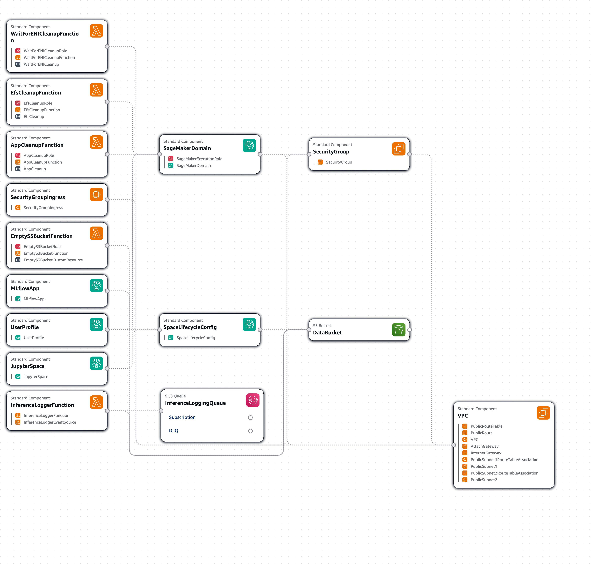
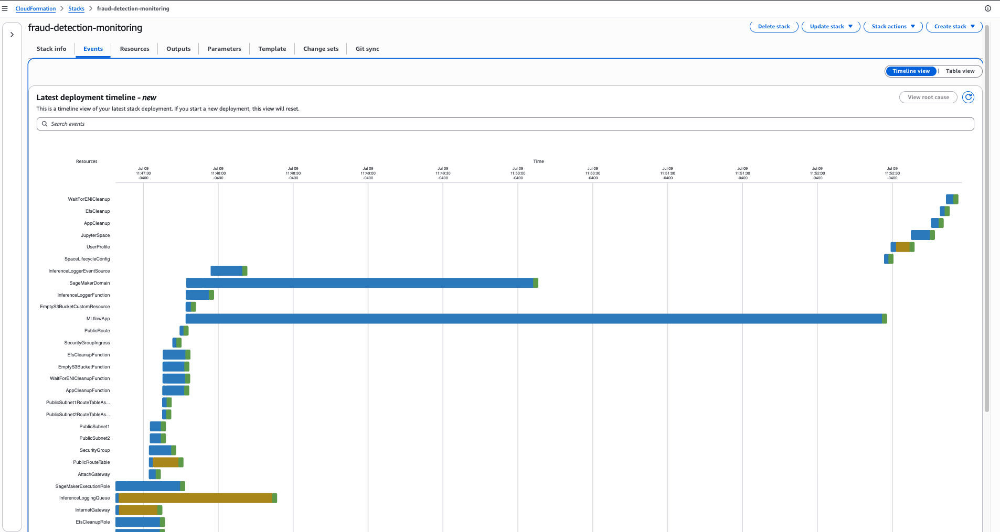

# CloudFormation

This directory holds every CloudFormation asset for the solution: two templates (the base SageMaker/MLflow stack and the drift-monitoring plane), the shell scripts that deploy/delete them, and reference diagrams. Two stacks exist because they have different lifecycles — the base is a one-time setup, the drift plane is added after a model is trained and deployed.

## Deployment Order

```
1. sagemaker-mlflow-setup.yaml   ← base: SageMaker domain, S3, Athena, MLflow App, inference logger
2. Train + approve a model (Notebook 1)  and deploy the endpoint (Notebook 2)
3. drift-monitoring-infra.yaml   ← drift plane: SNS, SQS, writer Lambda, dashboard, alarms, IAM role
4. Optional: scripts/deploy_lambda_container.sh  ← builds the container-image drift Lambda + daily EventBridge rule
```

## Base Stack — `sagemaker-mlflow-setup.yaml`

Single-stack deployment of a ready-to-use SageMaker Studio environment. Provisions the domain, user profile, JupyterLab space, MLflow app, and supporting infrastructure. On first space launch the lifecycle script clones this repo, downloads Kaggle training data, uploads to S3, creates Athena tables, and writes a populated `.env` into the space.

### What the stack creates

- **VPC** with two public subnets, Internet Gateway, route table, and security group
- **SageMaker Domain** (`PublicInternetOnly` mode) with an IAM execution role
- **User Profile** and a **JupyterLab Space** wired to the lifecycle script
- **Lifecycle configuration** — clones the GitHub repo, writes a populated `.env` on first launch
- **SageMaker MLflow App** (serverless) for experiment tracking. Provisioned via the native `AWS::SageMaker::MlflowApp` CloudFormation resource type; the output `MLflowAppArn` is written to `.env` as `MLFLOW_TRACKING_URI`.
- **S3 data bucket** with versioning, encryption, and lifecycle rules
- **Athena tables** created by the lifecycle script from `dataset_schema.yaml`
- **SQS queue** + **inference-logger Lambda** — endpoint predictions are batched (10 msgs or 30 s) and INSERTed into `inference_responses`
- **Cleanup Lambdas** for S3 objects, ENIs, and SageMaker apps so the stack deletes cleanly

Resource names are all parameterized by `ProjectName`, so the same template can be deployed multiple times in the same account.

### Resource layout



### Creation timeline



### Deploy

```bash
./deploy-main-stack.sh                            # default: fraud-detection-monitoring in us-west-2
./deploy-main-stack.sh my-other-stack             # override stack name
AWS_REGION=us-east-1 ./deploy-main-stack.sh       # override region via env var
./deploy-main-stack.sh --recreate-database        # DESTRUCTIVE one-shot: wipe Athena DB + S3 prefixes before deploy
```

Creation takes 10–15 minutes. Idempotent — re-runs create if missing, update if present.

**`--recreate-database`** drops the `fraud_detection` Athena database, deletes all 7 table S3 prefixes, then lets the lifecycle script re-seed on next space launch. Use after a schema change or when Iceberg metadata gets corrupted. One-shot: only fires during that deploy, not on subsequent Space restarts.

### Optional parameters

| Parameter | Purpose |
|-----------|---------|
| `ProjectName` | Prefix for all named resources (default: `fraud-detection-monitoring`) |
| `UserProfileName` | Name of the SageMaker user profile |
| `JupyterLabInstance` | Instance type for the JupyterLab space |
| `GitHubRepo` | Repo URL the lifecycle script clones |
| `UseExistingBucket` / `UseExistingRole` / `UseExistingVPC` | Reuse existing resources instead of creating new ones |

### After deploy

1. AWS console → **SageMaker** → **Domains** → `<ProjectName>-domain`
2. Select the user profile → **Spaces** → **Run Space**
3. In JupyterLab terminal, verify:
   - `sample-mlops-bestpractices/` directory is present
   - `.env` has `AWS_DEFAULT_REGION`, `SAGEMAKER_EXEC_ROLE`, `MLFLOW_TRACKING_URI`, `DATA_S3_BUCKET` populated
4. Open the MLflow UI: SageMaker Studio → **Partner AI Apps** → **MLflow**. The App URL isn't a CFN output — you reach it via the Studio console. Python code uses the `MLFLOW_TRACKING_URI` ARN already in `.env`.

### Update

```bash
./deploy-main-stack.sh  # re-run — CloudFormation handles updates as an update-stack call
```

Domain replacement (when immutable properties change) takes 10–15 minutes. The app-cleanup Lambda tears down running JupyterLab apps automatically before the old space is deleted.

### Delete

```bash
./delete-main-stack.sh <stack-name> <region>   # robust delete with pre-drain
```

Or manual:

```bash
aws cloudformation delete-stack --stack-name <name> --region <region>
```

The stack deletes cleanly without manual intervention in the happy path:

1. App-cleanup Lambda deletes any JupyterLab apps
2. CloudFormation deletes the space, user profile, domain, MLflow app
3. ENI-cleanup Lambda waits for SageMaker-created ENIs to detach
4. S3-cleanup Lambda empties the data bucket
5. VPC, subnets, IAM roles, and remaining resources tear down

If it gets stuck, see the [Troubleshooting](#troubleshooting) section below.

---

## Drift-Monitoring Stack — `drift-monitoring-infra.yaml`

Companion stack that provisions the drift-monitoring plane the monitoring notebook (`3_inference_monitoring.ipynb`) assumes already exists. Deploy this **after** the base stack + a trained/deployed model — it depends on the base stack's data bucket and endpoint.

### What the stack creates

- **SNS topic** `fraud-detection-drift-alerts` with an optional email subscription
- **SQS queue** `fraud-monitoring-results` the drift Lambda writes results to
- **Monitoring-results writer Lambda** `fraud-monitoring-results-writer` — drains the queue and INSERTs each drift run into `monitoring_responses`. Includes its IAM role and SQS event-source mapping.
- **Drift-monitor IAM role** `fraud-detection-drift-monitor-role` — the role the scheduled container Lambda assumes
- **CloudWatch dashboard** `FraudDetection-DriftMonitoring` + **alarms** (PSI data drift, ROC-AUC / accuracy / precision / recall degradation), wired to the SNS topic

### What the stack does NOT create (by design)

The **scheduled drift-monitor Lambda itself is a container image** built with `docker build`, which CloudFormation can't do. Deploy it separately after this stack:

```bash
python main.py monitoring deploy-lambda --alert-email you@example.com
```

That CLI reuses the IAM role and SNS topic this stack creates and wires the daily EventBridge rule.

### Deploy

```bash
./deploy-drift-monitoring.sh \
    --data-bucket <your-data-bucket> \
    --endpoint-name fraud-detector-endpoint \
    --alert-email you@example.com
```

The wrapper does pre-flight validation (base stack exists, bucket exists, endpoint exists) then invokes `aws cloudformation deploy`. Idempotent — re-run to apply parameter or threshold changes. If you set `AlertEmail`, confirm the SNS subscription email that AWS sends on create.

Manual CLI equivalent:

```bash
aws cloudformation deploy \
  --template-file drift-monitoring-infra.yaml \
  --stack-name fraud-detection-drift-monitoring \
  --capabilities CAPABILITY_NAMED_IAM \
  --region <your-region> \
  --parameter-overrides \
      DataBucketName=<your-data-bucket> \
      EndpointName=fraud-detector-endpoint \
      AlertEmail=you@example.com
```

### Key parameters

| Parameter | Default | Purpose |
|-----------|---------|---------|
| `DataBucketName` | *(required)* | S3 data-lake bucket (base stack's `DataBucket` output) |
| `EndpointName` | `fraud-detector-endpoint` | Endpoint being monitored (CloudWatch metric dimension) |
| `AlertEmail` | *(empty)* | Email to subscribe to drift alerts; blank skips the subscription |
| `AthenaDatabase` | `fraud_detection` | Glue/Athena database holding the Iceberg tables |
| `DataDriftThreshold` | `0.2` | PSI value above which the data-drift alarm fires |
| `ModelDriftThreshold` | `0.05` | Relative degradation (5%) above which model-drift alarms fire |

### Outputs

Read by the monitoring notebook's "Confirm infrastructure" cell and by `main.py monitoring deploy-lambda`:

`DriftAlertsTopicArn`, `MonitoringResultsQueueUrl`, `MonitoringResultsQueueArn`, `MonitoringWriterFunctionArn`, `DriftMonitorRoleArn`, `DashboardName`, `DashboardURL`.

### Delete

Delete the out-of-band drift Lambda first (it references this stack's SQS queue, SNS topic, and IAM role):

```bash
python main.py monitoring deploy-lambda --delete   # or: aws lambda delete-function --function-name fraud-detection-drift-monitor
aws cloudformation delete-stack \
  --stack-name fraud-detection-drift-monitoring \
  --region <your-region>
```

---

## Files

| File | Purpose |
|------|---------|
| `sagemaker-mlflow-setup.yaml` | Base-stack CloudFormation template |
| `drift-monitoring-infra.yaml` | Drift-plane CloudFormation template |
| `deploy-main-stack.sh` | Deploy/update the base stack |
| `deploy-drift-monitoring.sh` | Deploy the drift-monitoring stack (with pre-flight checks) |
| `cleanup-main-resources.sh` | Pre-delete cleanup helper (stops Studio apps, waits for ENIs) |
| `delete-main-stack.sh` | Robust base-stack teardown (drains Iceberg tables, empties S3, stops Studio) |
| `force-delete-main-stack.sh` | Nuclear option — deletes stuck resources manually (ENIs, subnets, versioned S3), then retries with `--retain-resources` |
| `cfn-infrastructure-composer.png` | Infrastructure Composer view of the base stack |
| `Stack-timeline.png` | Creation timeline and resource dependencies of the base stack |
| `README.md` | This file |

## Troubleshooting

**Stack creation fails quickly with an IAM or name conflict.**
Another stack with the same `ProjectName` already exists in the account. Delete it or pick a different `ProjectName`.

**JupyterLab space shows `Failed` after Space launch.**
Check CloudWatch Logs under `/aws/sagemaker/studio`, filtered by domain ID. The lifecycle script logs each step and runs `curl -I https://github.com` on failure so connectivity issues are visible.

**`git clone` times out during space launch.**
Confirm `AppNetworkAccessType` on the domain is `PublicInternetOnly` — that's what the template sets. `VpcOnly` mode requires a NAT Gateway or private DNS endpoints this template doesn't provision.

**Base stack deletion stuck on subnet or bucket.**
The ENI-cleanup and S3-cleanup Lambdas usually handle this — re-run `delete-stack` after a few minutes. If the stack reaches `DELETE_FAILED`, use `./force-delete-main-stack.sh <stack-name> <region>` — it empties the bucket, removes stuck SageMaker ENIs, deletes subnets manually, retries with `--retain-resources`, and cleans up leftover Lambdas + IAM roles. `./cleanup-main-resources.sh` is the lighter-weight helper for stopping apps + waiting for ENIs before delete.

**Drift stack deletion fails referencing the drift Lambda.**
The container-image drift Lambda is deployed *outside* the drift-monitoring stack (it holds the SQS queue's event source mapping). Delete it first — see the [Drift Stack Delete](#delete-1) section.

**`main.py dashboard create` fails on QuickSight subscription check.**
The QuickSight setup is a one-time console step (per AWS account) not automated by CloudFormation. See the main [README's `QuickSight prerequisites` section](../README.md#quicksight-prerequisites-one-time-per-account) for the 5-minute walkthrough.
