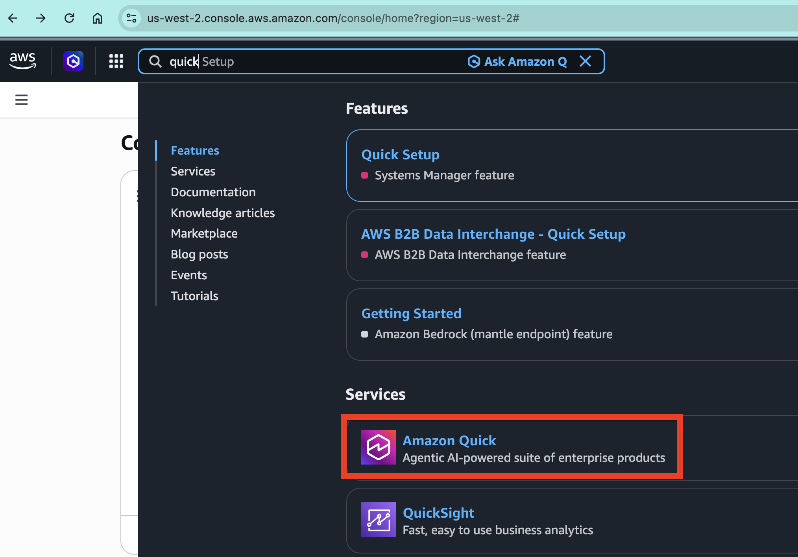
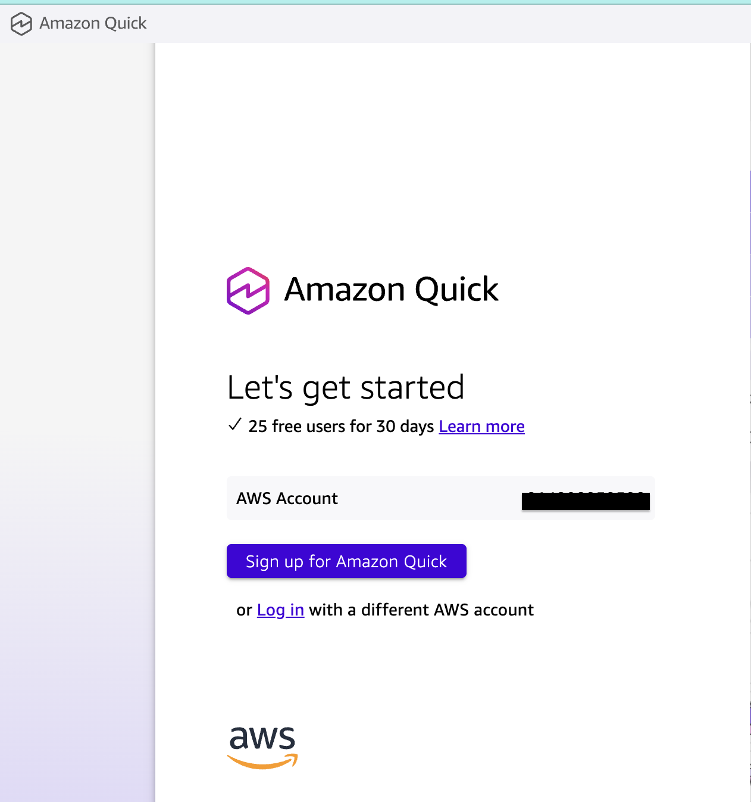
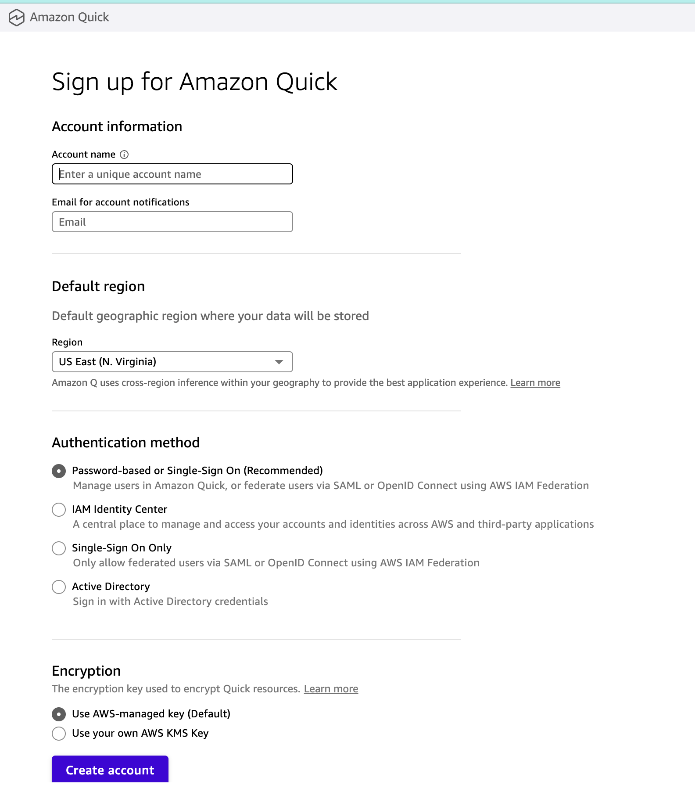
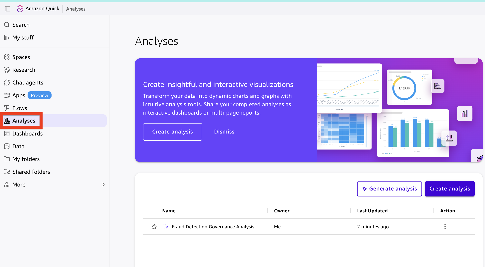
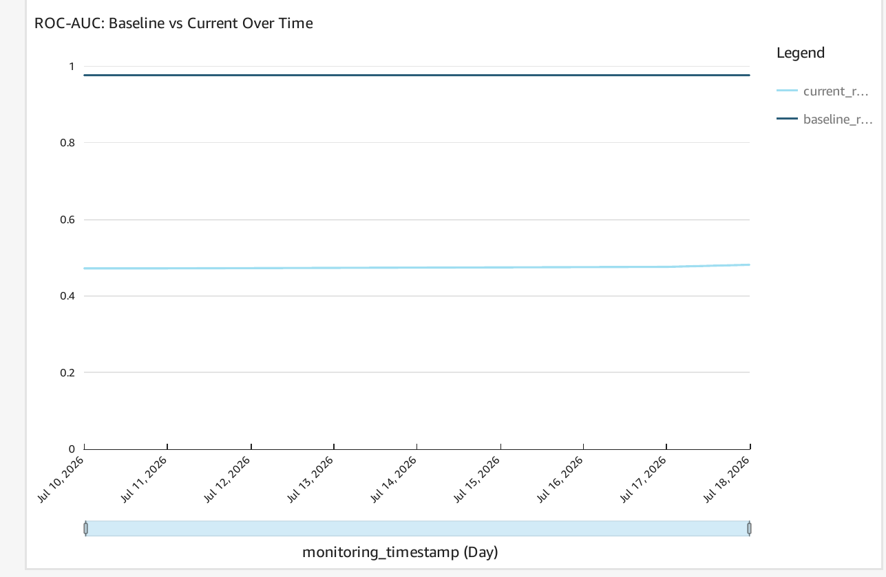
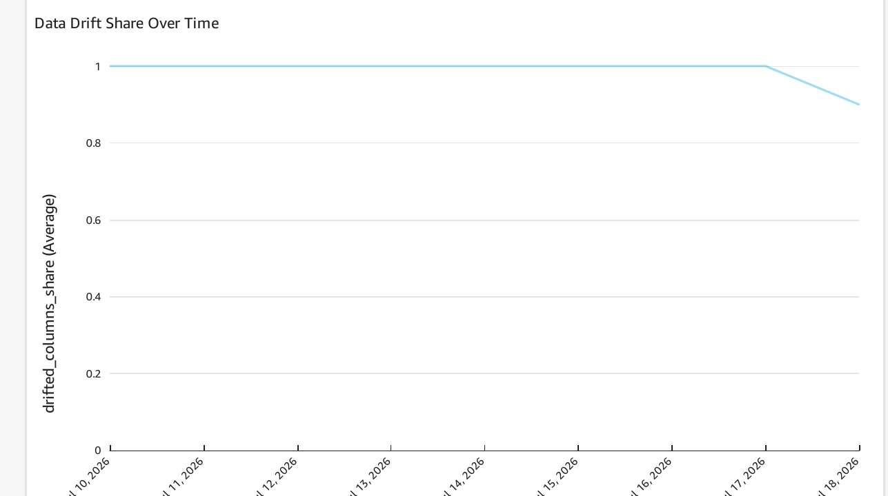
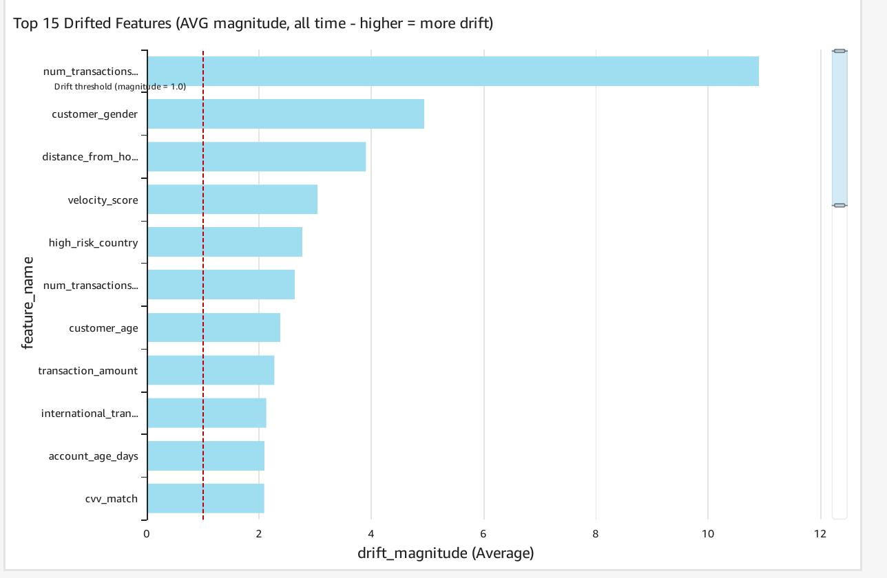
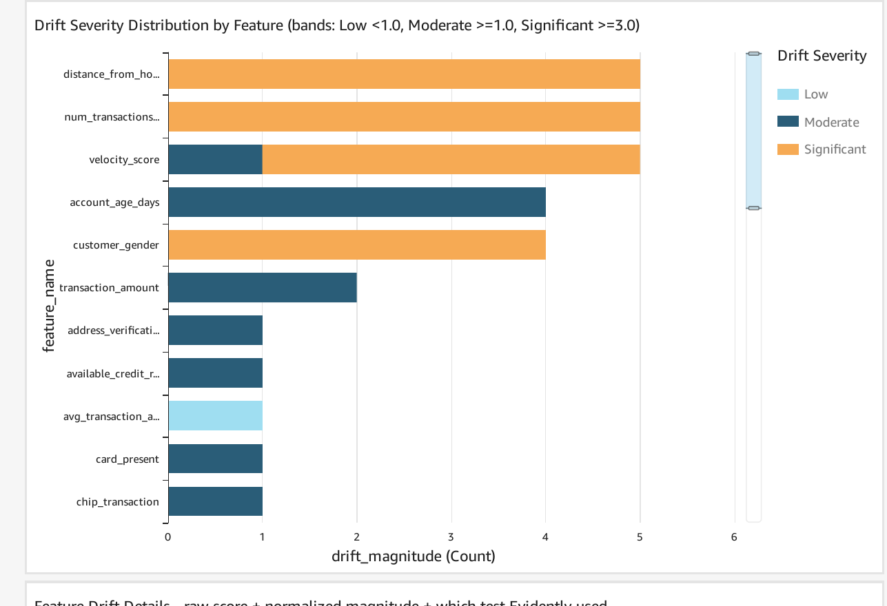
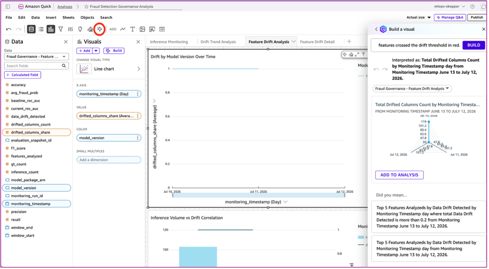

# QuickSight Setup Guide

This guide shows you how to set up Amazon QuickSight for the MLOps Governance Dashboard in a new AWS account.

---

## Prerequisites

- ✅ CloudFormation stack deployed
- ✅ Athena database with `fraud_detection` tables populated
- ✅ AWS account with admin access

---

## Setup Steps

### Step 1: Sign Up for QuickSight

1. Go to AWS Console → **Amazon QuickSight**
2. Click **"Sign up for QuickSight"**
3. Choose **Enterprise Edition** (required for programmatic dashboard creation)
4. Configure:
   - **Authentication**: IAM Identity Center or IAM only
   - **Account name**: Choose any name (e.g., `fraud-detection-monitoring`)
   - **Email**: Your admin email
5. Click **"Finish"** and wait 2-3 minutes



---

### Step 2: Configure Regions in .env

QuickSight supports different regions for identity (where you signed up) and data (where your S3/Athena data lives).

Add to your `.env` file:

```bash
# The region where your data lives (S3, Athena)
AWS_DEFAULT_REGION=us-west-2

# The region where you signed up for QuickSight
QUICKSIGHT_IDENTITY_REGION=us-west-2
```

**Note**: If your data is in us-east-1, both values can be `us-east-1`. If you signed up for QuickSight in a different region, update `QUICKSIGHT_IDENTITY_REGION` accordingly.

These values are also configurable in `src/config/config.yaml`.

---

### Step 3: Run the Governance Dashboard Notebook

1. Open `notebooks/4_governance_dashboard.ipynb`
2. **Restart kernel** (to reload `.env` with the QuickSight region)
3. **Run all cells**

The notebook will create:
- Athena data source
- 5 datasets (inference, accuracy, drift, features, monitoring)
- Dashboard with visualizations





---

## Final Result

After running all notebooks (1-4), your QuickSight dashboard will look like this:



> **Where do these numbers come from?** Every drift and classification metric in the dashboard is produced by **Evidently AI** inside the scheduled drift Lambda (`fraud-detection-drift-monitor`). Evidently's output is written to the `monitoring_responses` Athena table; QuickSight reads that table directly. There is no separate drift computation in the SQL or in QuickSight — the same numbers are logged to MLflow on the same run, so the dashboard and any MLflow experiment view of the same `monitoring_run_id` are guaranteed to agree.

The dashboard shows:
- **Model performance metrics** (from Evidently `ClassificationPreset`): Accuracy, precision, recall, F1, ROC-AUC
- **Drift detection trends** (from Evidently `DataDriftPreset` and `ClassificationPreset`): Data drift and model drift over time
- **Inference metrics** (from raw `inference_responses` Athena table, not Evidently): Volume and latency
- **Feature-level drift magnitudes** (from Evidently `DataDriftPreset`, normalized to `drift_magnitude` in `evidently_reports.py`): Per-feature drift analysis — visualized as `drift_magnitude` (× past threshold; 1.0 = at threshold, ≥ 3.0 = severe). Test-agnostic across features regardless of which statistical test Evidently picked per column (KS, Chi-square, Wasserstein, or Jensen-Shannon)

---

## Reading the Dashboard: A Worked Drift Story

The dashboard has three sheets — **Model Drift**, **Data Drift**, and **Feature Drift** — laid out to be read top-down so you go from *symptom* → *cause* → *culprit* → *does it matter*. Full-page exports of each sheet are in this folder ([`Model_Drift_Trends.pdf`](Model_Drift_Trends.pdf), [`Data_Drift_Trends.pdf`](Data_Drift_Trends.pdf), [`Feature_Drift_Trends.pdf`](Feature_Drift_Trends.pdf)); the cropped panels below live in [`narrative/`](narrative/). All numbers are a real run of this repo against the demo data — the same Evidently output stored in `monitoring_responses`.

### Sheet 1 — Model Drift: is the model still healthy?

ROC-AUC dropped from the frozen baseline **~0.98** to **~0.48** (≈51% degradation); the model-drift verdict fired on every run. That's the alarm — the other two sheets explain it.



### Sheet 2 — Data Drift: did the inputs move?

**~93% of features drifted** (share ≈ 0.9–1.0, ~28 of 30 columns), with alerts firing. Broad input drift is the expected precursor to a performance collapse.



### Sheet 3 — Feature Drift: which columns, ranked by `drift_magnitude`

Every column is ranked by **`drift_magnitude`** — a test-agnostic "× past threshold" number that stays comparable no matter which test Evidently picked per column. `num_transactions_24h` leads at **~11×**; the "Highest Drift Magnitude" KPI shows the worst single feature-run at **12.76×**.



The severity heatmap and distribution give the same ranking as bands (Low `<1.0` / Moderate `≥1.0` / Significant `≥3.0`):



> ⚠️ **These visuals use `drift_magnitude`, never raw `drift_score`.** Evidently picks a different test per column (KS p-value vs. Wasserstein distance), and those raw scores move in opposite directions on incomparable scales — so ranking or averaging raw `drift_score` across features is meaningless. Earlier versions of these screenshots (`DriftScore-Average.png`, `DriftScore-Sum.png`, `DriftScore-Variance-Population.png`, `Feature_drift_time.png`) plotted raw score and were dominated by a single mis-scaled feature reading ~1000×; they were **removed** because they told a false story.

### Sheet 3 + SHAP — does the drift actually matter?

Drift magnitude tells you *what changed*; SHAP (from `notebooks/7_optional_shap_explainability.ipynb`) tells you *what the model relies on*. Cross-referencing the two is what turns a list of anomalies into a prioritized action list.


| Feature | Drift magnitude | SHAP importance (rank) | Verdict |
|---|---|---|---|
| `num_transactions_24h` | **×10.9** (worst) | **0.294 (#2)** | 🔴 High-risk — top-2 model driver *and* most-drifted → primary suspect for the AUC drop |
| `account_age_days` | ×2.1 | **0.365 (#1)** | 🔴 High-risk — the single most important feature is drifting |
| `customer_age`, `transaction_amount` | ×2.4, ×2.3 | 0.104, 0.083 (#7, #8) | 🟠 Important and drifting — monitor / retrain |
| `customer_gender` | ×4.9 (2nd-worst drift) | **0.001 (#30, last)** | 🟢 Low-risk noise — heavily drifted but the model ignores it |

**Takeaway:** ranked by drift alone you'd chase `customer_gender`; ranked by drift **×** importance the real culprit is `num_transactions_24h`. That intersection is the story the dashboard is built to tell.

---

## Troubleshooting

| Issue | Fix |
|-------|-----|
| "QuickSight not subscribed" | Complete Step 1 (sign up) |
| "Access Denied" | Ensure your user has QuickSight Admin role |
| "Directory information not found" | Verify `QUICKSIGHT_IDENTITY_REGION` matches where you signed up |
| Dashboard shows "No data" | Verify Athena tables have data: `SELECT COUNT(*) FROM fraud_detection.inference_responses` |

---

## Cost

- **QuickSight Enterprise**: $24/user/month
- **Additional viewers** (read-only): $5/month (capped)

---

## Creating Custom Visualizations with Natural Language

QuickSight Q allows you to create custom charts by asking questions in plain English. This is especially powerful for ad-hoc drift analysis and trend exploration beyond the pre-built 32-visual dashboard.



### How to Use QuickSight Q

1. Open your QuickSight dashboard
2. Click the **Q search bar** at the top
3. Type your question in natural language
4. QuickSight automatically generates the appropriate visualization
5. Click **"Add to dashboard"** to save the visual

### Sample Natural Language Queries for Drift Analysis

#### **Drift Trend Analysis**

**Top drifting features over time:**
```
Show me a time series chart of the top 5 drifted features over the last 30 days 
with drift_magnitude on the y-axis, grouped by day. Include a horizontal line at 
magnitude=1.0 (the drift threshold). Add a second chart below showing daily 
prediction volume. Highlight days where more than 3 features had magnitude > 1.0 in red.
```

**What it generates:**
- Dual-axis chart with feature drift trends and volume correlation
- Threshold reference line to identify violations
- Color-coded alerts for high-drift days

---

**Feature drift severity distribution:**
```
Create a heatmap showing which features drifted each day over the last 14 days. 
Features on rows, dates on columns, color intensity by drift_magnitude. Highlight 
any cell with drift_magnitude > 3.0 in dark red (severe drift — 3× past threshold).
```

**What it generates:**
- Grid view of feature × date drift intensity
- Quick identification of chronic drifters vs. one-off spikes

---

**Drift score evolution by model version:**
```
Show drift_magnitude trends comparing model version 1 vs version 2 over the last 
7 days. Use separate lines for each version. Add a trend line to show if 
drift is improving or worsening after retraining.
```

**What it generates:**
- Multi-series comparison to validate retraining effectiveness
- Trend analysis showing drift trajectory

---

#### **Model Performance Analysis**

**ROC-AUC degradation timeline:**
```
Create a line chart showing ROC-AUC over the last 30 days with the baseline 
ROC-AUC as a horizontal reference line. Color the line green when above 
baseline, red when below. Add data labels on the 5 lowest points.
```

**What it generates:**
- Visual performance tracking with automatic baseline comparison
- Instant identification of worst-performing days

---

**Prediction distribution shift (Sankey diagram):**
```
Create a Sankey diagram showing how prediction bucket distributions shifted 
from the baseline week to last week. Show flows from training data buckets 
(very_low to very_high fraud probability) to current production buckets. 
Highlight any bucket that changed by more than 10 percentage points in red.
```

**What it generates:**
- Flow visualization of prediction score migration
- Identifies concept drift (score distribution shifts)
- Red highlighting for significant bucket changes (>10pp)

**Example use case:** If your "high confidence fraud" bucket (0.8-1.0 probability) was 5% of training predictions but is now 15% in production, the Sankey will show a thick red flow, indicating the model is predicting fraud more aggressively.

---

**Ground truth coverage and accuracy:**
```
Show a combo chart with ground truth coverage percentage (bars) and model 
accuracy (line) over the last 30 days. Add a warning annotation on days 
where coverage drops below 20%.
```

**What it generates:**
- Dual metric visualization showing data quality vs. performance
- Alerts when model drift metrics become unreliable (low coverage)

---

#### **Feature-Level Deep Dives**

**Credit limit drift investigation:**
```
Show me the credit_limit feature distribution from training data vs last 7 days 
of production data as overlapping histograms. Include mean, median, and standard 
deviation for both distributions. Highlight bins where production frequency is 
more than 2x training frequency in orange.
```

**What it generates:**
- Side-by-side distribution comparison
- Statistical summary to quantify shift magnitude
- Outlier bin identification

---

**Repeat offender features:**
```
Create a bar chart showing how many times each feature has been flagged for drift 
in the last 30 days. Sort descending. Color bars green for 0-2 flags, yellow for 
3-5 flags, red for 6+ flags. Add a table below listing retraining recommendations 
for features with 6+ flags.
```

**What it generates:**
- Chronic drift ranking (retraining priority list)
- Color-coded severity scoring
- Actionable retraining guidance

---

#### **Correlation and Anomaly Detection**

**Drift vs. volume correlation:**
```
Create a scatter plot with daily prediction volume on x-axis and drift percentage 
on y-axis for the last 60 days. Add a trend line. Highlight outliers where volume 
is high but drift is normal (green) or volume is low but drift is high (red).
```

**What it generates:**
- Identifies spurious drift caused by low sample sizes
- Finds genuine drift despite high volumes (true alerts)

---

**Cross-model drift comparison:**
```
Show a grouped bar chart comparing average drift scores across all deployed model 
versions over the last 14 days. Group by model version, color by severity 
(low/medium/high drift). Add a line showing inference volume per version.
```

**What it generates:**
- Multi-model drift landscape
- Version comparison for rollback decisions

---

### Tips for Writing Effective Queries

1. **Be specific about time ranges**: "last 30 days" vs. "last week" vs. "since Jan 1"
2. **Specify chart type**: line chart, bar chart, heatmap, Sankey, scatter plot
3. **Define thresholds explicitly using `drift_magnitude`**: ">1.0 magnitude (drifted)", ">3.0 magnitude (severe)", ">10 percentage points AUC drop", ">20% of features drifted"
4. **Request color coding**: "highlight in red", "color green when above baseline"
5. **Ask for multiple visuals**: "Add a second chart below", "with a table underneath"
6. **Include statistical summaries**: "with mean and median", "add trend line"

### When to Use Natural Language Queries vs. Pre-Built Dashboard

| Use Natural Language Q | Use Pre-Built Dashboard |
|------------------------|-------------------------|
| Ad-hoc investigation of specific features | Daily/weekly monitoring routine |
| Custom time ranges (last 14 days, specific date range) | Standard 7/30-day lookback windows |
| Comparing multiple model versions side-by-side | Tracking single deployed model |
| Creating one-off reports for stakeholders | Ongoing governance and compliance |
| Exploring correlations not in the 32 visuals | Established drift/performance metrics |
| Testing "what-if" threshold changes | Production alerting at configured thresholds |

---

**Next Steps**: Once the dashboard is created, you can access it anytime at:
- QuickSight Console → **Dashboards** → **"Fraud Detection Governance Dashboard"**
- Use **QuickSight Q** (search bar) for custom natural language queries
